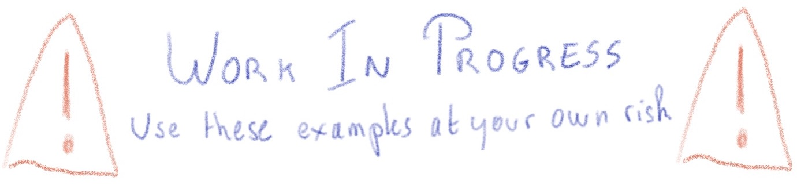
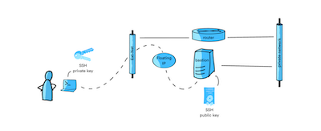

# Public cloud examples

Here is a list of examples which use multiple OVHcloud [Public Cloud products](https://www.ovhcloud.com/fr/public-cloud/).

You've developed a new cool feature? Fixed an annoying bug? We'd be happy to hear from you!

# 👀 Getting Started

 - [Starting Pack to manage your OVHcloud Services from shell](./basics/README.md)

Follow this tutorial to setup your Public Cloud environment. 

That gives you the procedure to install and use many tools to manage the components described in examples, like Terraform, Ansible, Openstack CLI, OVHcloud API, and more.

# ✍️  Examples

| Link | Description | | Resources | App | Necessary tools
|---|---|---|---|---|---
| [🔗](./examples/01) | **01** - A virtual machine connected to a private network. |  | Private network Instance SSH keypair | N/A | Terraform
| [🔗](./examples/02) | **02** - A virtual machine and a managed MongoDB database both connected to a private network, and a `mongosh` CLI. |  | Private network Instance SSH keypair MongoDB | mongosh CLI| Terraform Ansible
| [🔗](./examples/03) | **03** |  | Private network Kubernetes MySQL | Wordpress | Terraform Ansible
| [🔗](./examples/04) | **04** |  | Private network Instance | Mastodon | Terraform Ansible

# 🔬 Tools for labs

 - [Create instances with K3s installed on OVHcloud Public Cloud](./labs/labk3s/README.md)

# Related links

 * Contribute: https://github.com/ovh/public-cloud-examples/blob/master/CONTRIBUTING.md
 * Report bugs: https://github.com/ovh/public-cloud-examples/issues

# Contributing

Please read the [contributing guide](https://github.com/ovh/public-cloud-examples/blob/master/CONTRIBUTING.md) to learn about how you can contribute to this repository ;-). There is no small contribution, don't hesitate!

Our awesome contributors:

# License

Copyright 2022-2023 OVH SAS

Licensed under the Apache License, Version 2.0 (the "License");
you may not use this file except in compliance with the License.
You may obtain a copy of the License at

    http://www.apache.org/licenses/LICENSE-2.0

Unless required by applicable law or agreed to in writing, software
distributed under the License is distributed on an "AS IS" BASIS,
WITHOUT WARRANTIES OR CONDITIONS OF ANY KIND, either express or implied.
See the License for the specific language governing permissions and
limitations under the License.
