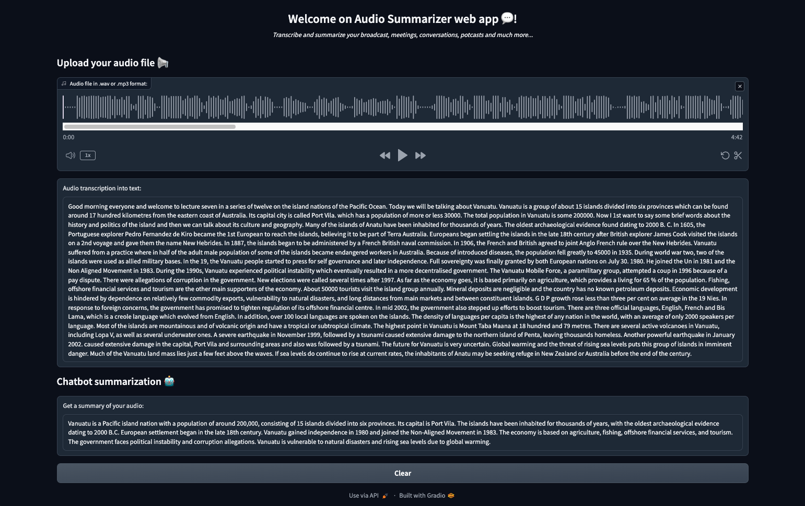

This project illustrate how to use Automatic Speech Recognition (ASR) and Large Language Models (LLM) to build an **Audio Summarizer Assistant** with [AI Endpoints](https://endpoints.ai.cloud.ovh.net/).

## How to use the project

- install the required dependencies: `pip install -r requirements.txt`

- create the `.env` file:
```
ASR_AI_ENDPOINT=https://nvr-asr-en-gb.endpoints.kepler.ai.cloud.ovh.net/api/v1/asr/recognize
LLM_AI_ENDPOINT=https://mixtral-8x22b-instruct-v01.endpoints.kepler.ai.cloud.ovh.net/api/openai_compat/v1
OVH_AI_ENDPOINTS_ACCESS_TOKEN=<ai-endpoints-api-token>
```  

- launch the Gradio app: `python audio-summarizer-app.py`


