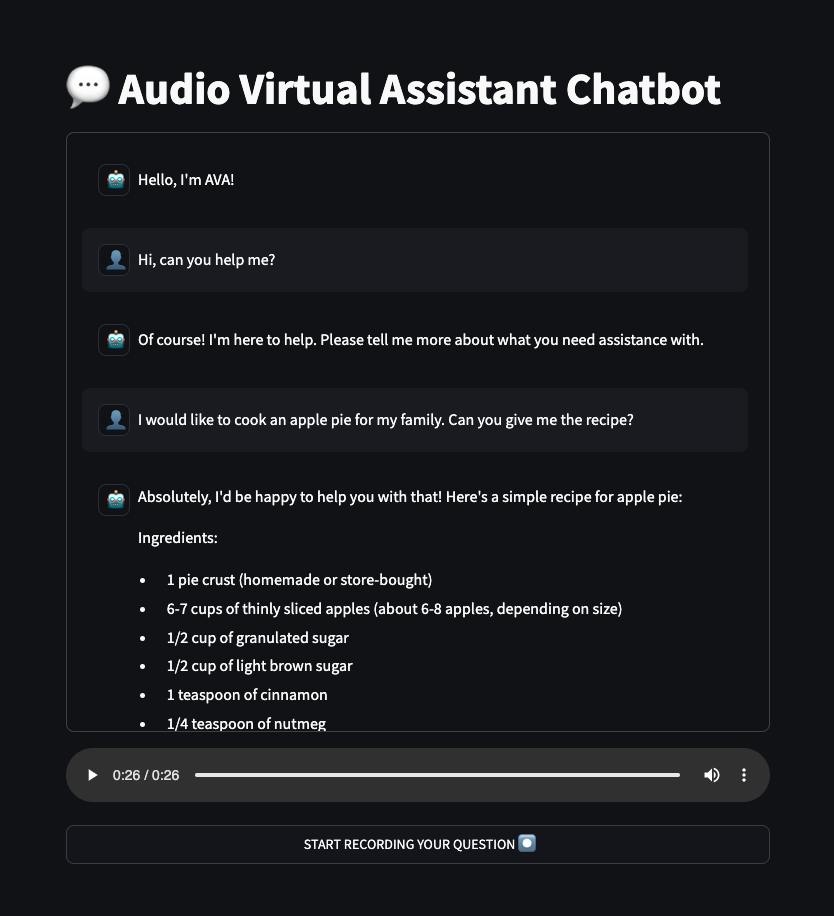

This project illustrate how to put Automatic Speech Recognition (ASR), Large Language Models (LLM) and Text To Speech (TTS) working together to build a powerful **Audio Virtual Assistant** with [AI Endpoints](https://endpoints.ai.cloud.ovh.net/).

## How to use the project

- install the required dependencies: `pip install -r requirements.txt`

- create the `.env` file:
```
ASR_AI_ENDPOINT=https://whisper-large-v3.endpoints.kepler.ai.cloud.ovh.net/api/openai_compat/v1
TTS_GRPC_ENDPOINT=nvr-tts-en-us.endpoints-grpc.kepler.ai.cloud.ovh.net:443
LLM_AI_ENDPOINT=https://mixtral-8x7b-instruct-v01.endpoints.kepler.ai.cloud.ovh.net/api/openai_compat/v1
OVH_AI_ENDPOINTS_ACCESS_TOKEN=<ai-endpoints-api-token>
```  

- launch the Gradio app: `python audio-virtual-assistant-app.py`


