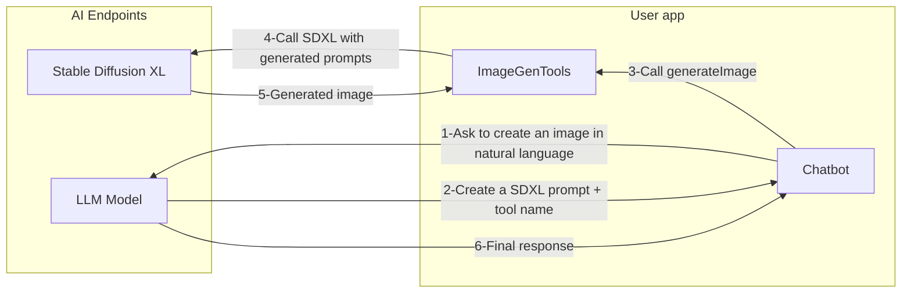

# Function Calling with LangChain4j and AI Endpoints

### 🧰 Pre requisites 🧰

  - Java 21+ installed (with preview mode enabled)
  - AI Endpoints API token
  - model to use: any of the LLM instruct models
  - have the following environment variables created:
    - OVH_AI_ENDPOINTS_ACCESS_TOKEN: the API token, see [documentation](https://help.ovhcloud.com/csm/en-gb-public-cloud-ai-endpoints-getting-started?id=kb_article_view&sysparm_article=KB0065401#generating-your-first-api-access-key) to know how to generate it
    - OVH_AI_ENDPOINTS_MODEL_URL: URL of the model, see [AI Endpoints website](https://endpoints.ai.cloud.ovh.net/) to know how to get it.
    - OVH_AI_ENDPOINTS_MODEL_NAME: model name, see [AI Endpoints website](https://endpoints.ai.cloud.ovh.net/) to know how to get it.
    - [JBang](https://www.jbang.dev/documentation/guide/latest/index.html) installed

## ⚡️ How to use the project ⚡️

  - run `jbang SimpleFunctionCalling.java` command
  - explain your image with natural language
  - see the result in the `generated-image.jpeg`
  - fine tune your prompt to get better results
  - enter `exit` to quit the application

## 🗺️ Architecture  🗺️

