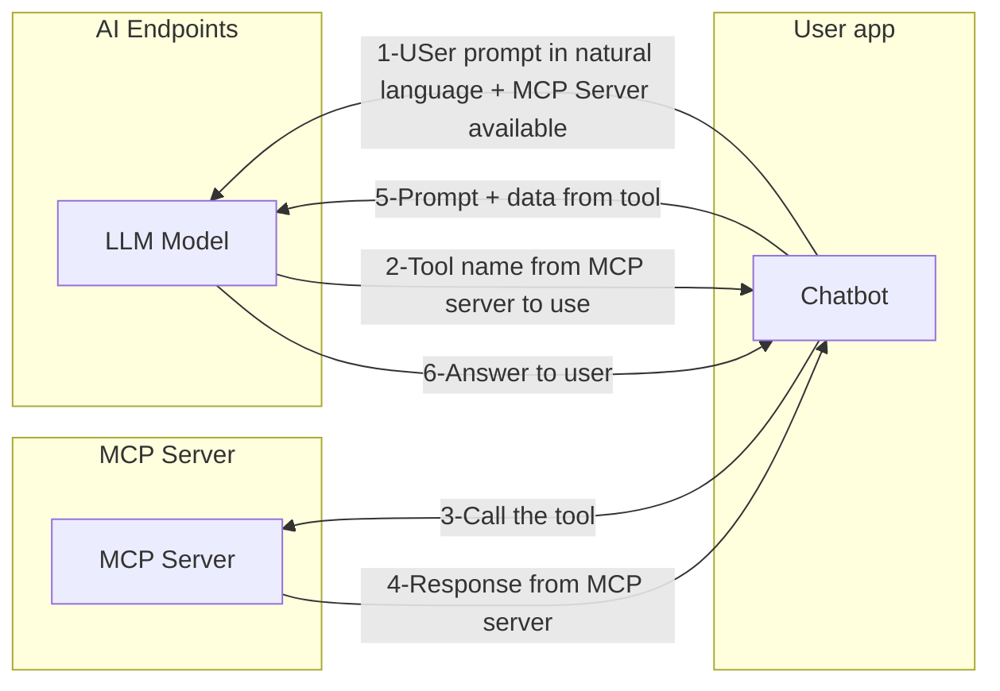

# MCP server and client with LangChain4j, Quarkus and AI Endpoints

### 🧰 Pre requisites 🧰

  - Java 24+ installed (with preview mode enabled)
  - AI Endpoints API token
  - model to use: any of the LLM instruct models
  - have the following environment variables created:
    - OVH_AI_ENDPOINTS_ACCESS_TOKEN: the API token, see [documentation](https://help.ovhcloud.com/csm/en-gb-public-cloud-ai-endpoints-getting-started?id=kb_article_view&sysparm_article=KB0065401#generating-your-first-api-access-key) to know how to generate it
    - OVH_AI_ENDPOINTS_MODEL_URL: URL of the model, see [AI Endpoints website](https://endpoints.ai.cloud.ovh.net/) to know how to get it.
    - OVH_AI_ENDPOINTS_MODEL_NAME: model name, see [AI Endpoints website](https://endpoints.ai.cloud.ovh.net/) to know how to get it.
    - MCP_SERVER_URL: Quarkus MCP server URL (for example `http://127.0.0.1:8080/mcp/sse`)
    - [JBang](https://www.jbang.dev/documentation/guide/latest/index.html) installed

## ⚡️ How to use the project ⚡️

  - run the MCP server in [ovh-mcp-server](./ovh-mcp-server) folder: `quarkus dev`
  - run `jbang SimpleMCPClient.java` command in [mcp-client](./mcp-client) folder

## 🗺️ Architecture  🗺️

