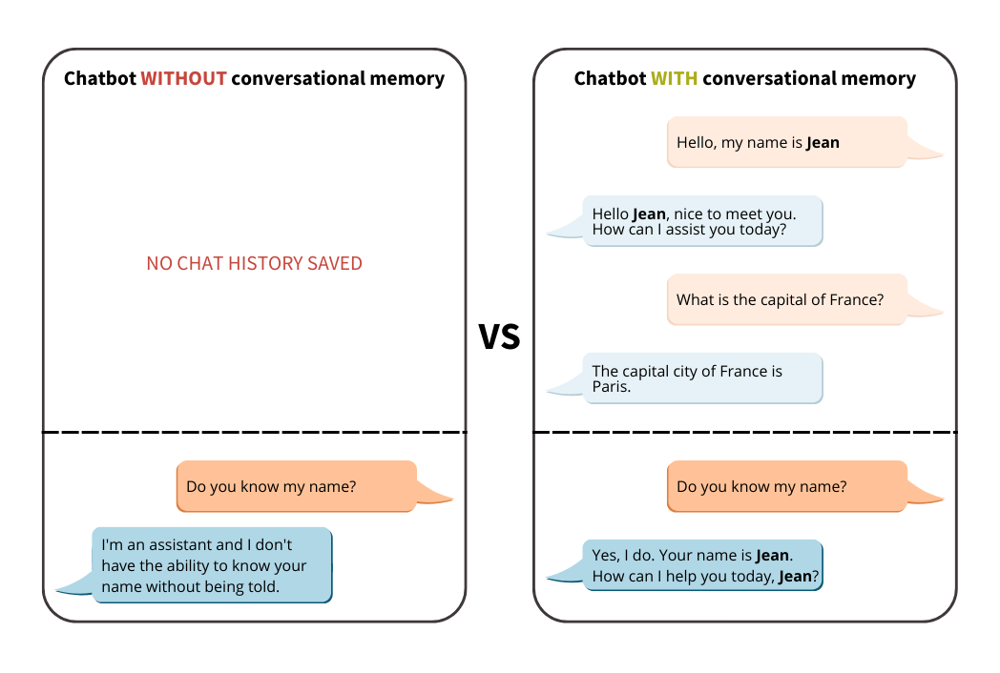

This project illustrate how to implement conversational memory and enable your chatbot to better answer questions using its knowledge. This use case is based on LangChain Memory module and Mistral7B available on [AI Endpoints](https://endpoints.ai.cloud.ovh.net/).

## How to use the project

- install the required dependencies: `pip install -r requirements.txt`

- create the `.env` file:
```
LLM_AI_ENDPOINT=https://mistral-7b-instruct-v0-3.endpoints.kepler.ai.cloud.ovh.net/api/openai_compat/v1
OVH_AI_ENDPOINTS_ACCESS_TOKEN=<ai-endpoints-api-token>
```

- access the notebook and launch the code cells: `chatbot-memory-langchain.ipynb`


