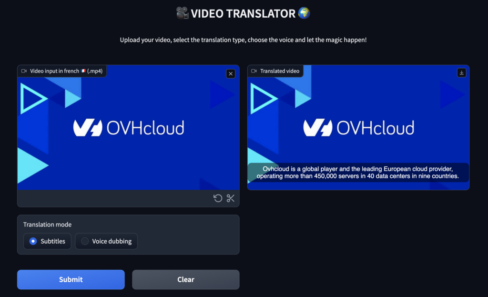

This project illustrate how to master Speech AI and create a **Video Translator** with [AI Endpoints](https://endpoints.ai.cloud.ovh.net/).
Subtitle and dub voices of any video using Automatic Speech Recognition (ASR), Neural Machine Translation (NMT) and Text To Speech (TTS) inside a powerful web app.

## How to use the project
- if the library **ffmpeg** is not already installed, launch the following command: `sudo apt install ffmpeg`

- install the required dependencies: `pip install -r requirements.txt`

- create the `.env` file:
```
ASR_AI_ENDPOINT=https://whisper-large-v3.endpoints.kepler.ai.cloud.ovh.net/api/openai_compat/v1
NMT_AI_ENDPOINT=https://t5-large.endpoints.kepler.ai.cloud.ovh.net/api/translate?from=English&target=French
TTS_GRPC_ENDPOINT=nvr-tts-en-us.endpoints-grpc.kepler.ai.cloud.ovh.net:443
OVH_AI_ENDPOINTS_ACCESS_TOKEN=<ai-endpoints-api-token>
```

- launch the Gradio app: `python3 main.py`


