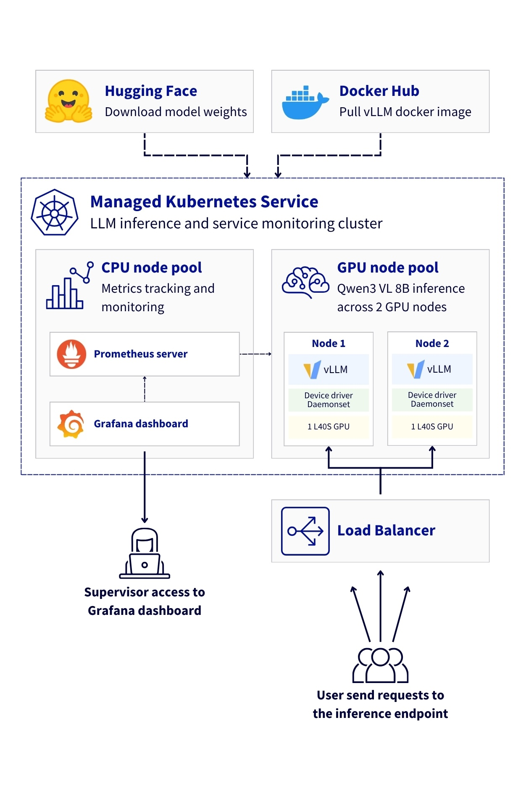

This project is linked to a reference architecture that details how to deploy Large Language Model (LLM) inference system using vLLM on OVHcloud **Managed Kubernetes Service (MKS)**. The solution leverages NVIDIA L40S GPUs to serve the `Qwen3-VL-8B-Instruct` multimodal model (vision + text) with OpenAI-compatible API endpoints.

## Prerequisites

Before you begin, ensure you have:
- An OVHcloud Public Cloud account
- An OpenStack user with the Administrator role
- A Hugging Face access – create a [Hugging Face account](https://huggingface.co/) and generate an access token
- `kubectl` installed and `helm` installed (at least version 3.x)

## How to use the project

Follow the different steps of this [architecture guide](**WAITING FOR ARTICLE PUBLICATION**) for a native GPU deployment of vLLM on MKS with full stack observability.

