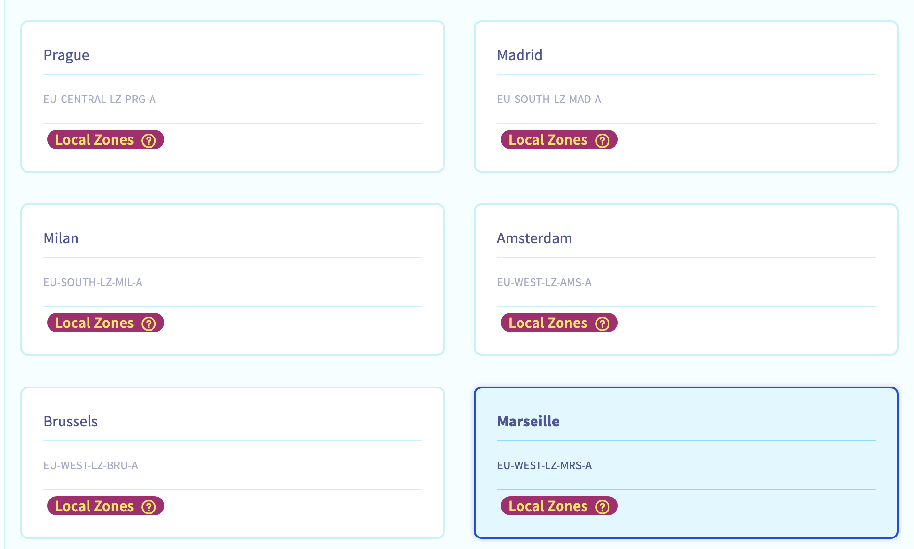
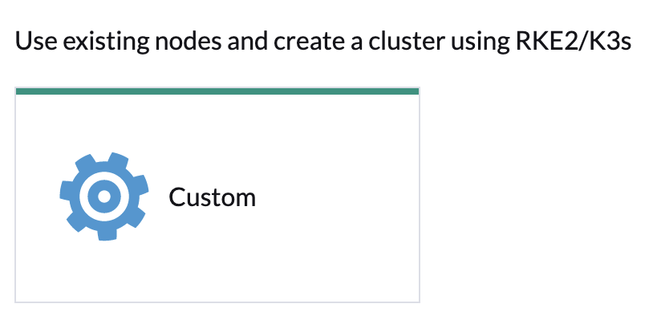
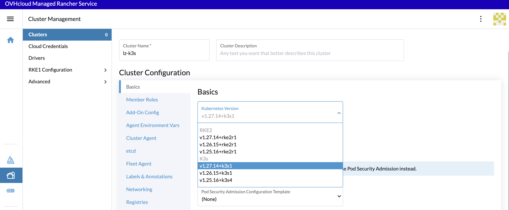
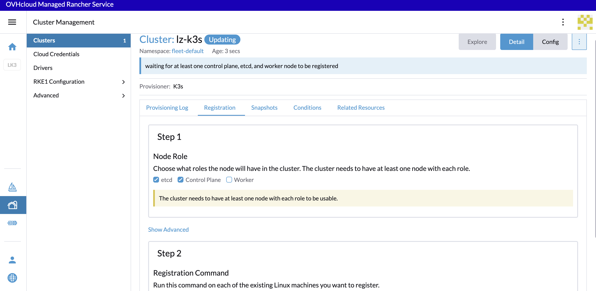
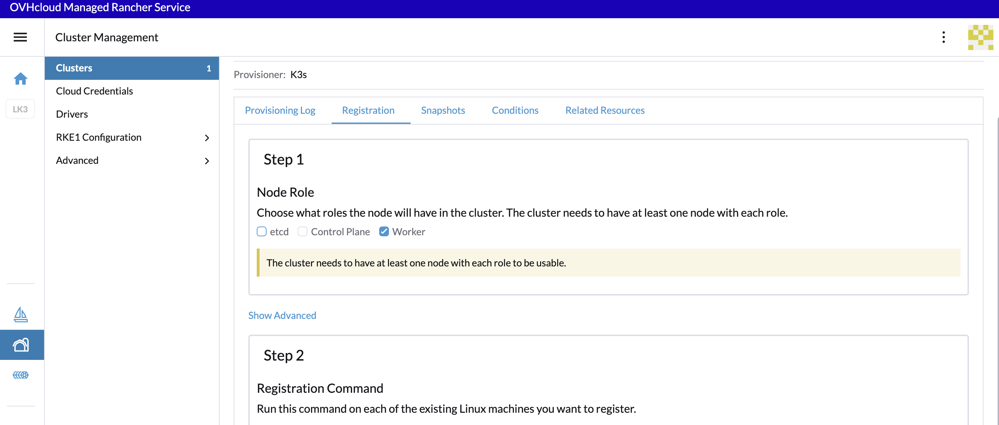
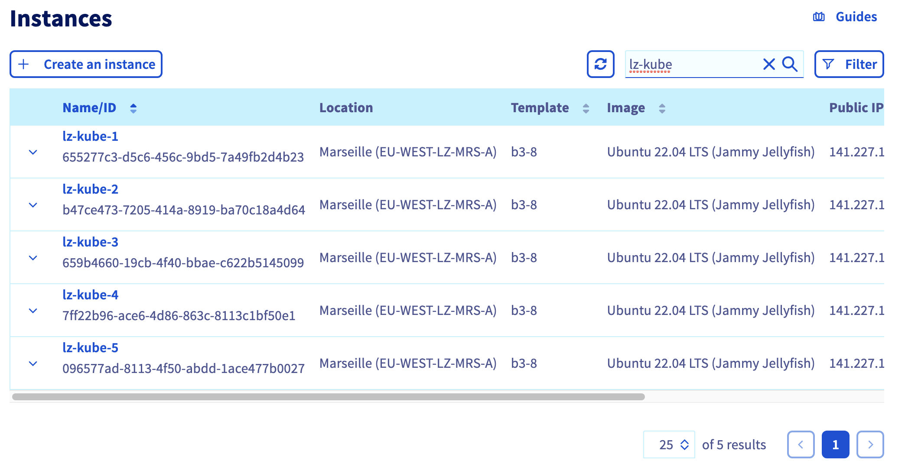

## Create a Kubernetes cluster in a Local Zone through Rancher

### General information
 - 🔗 [Getting started with Managed Rancher Service](https://help.ovhcloud.com/csm/en-gb-public-cloud-managed-rancher-service-getting-started?id=kb_article_view&sysparm_article=KB0061909)
 - 🔗 [Instances on Local Zone are free until 31th of August 2024](https://www.ovhcloud.com/fr/about-us/global-infrastructure/local-zone/)

### Set up

  - Install the [kubectl CLI](https://kubernetes.io/docs/tasks/tools/#kubectl)

### Demo

In this demo we will:
- create 5 instances (3 for the Kubernetes's etcd + controlplane & 2 for workers)
- create a managed Rancher
- In Rancher, configure the instances to deploy into them a Kubernetes cluster with k3s

### Create instances

  - log in to the OVHcloud Control Panel and open the **Public Cloud** section. Then access the **Instances** under the **Compute** section.

  - click on the **Create an instance** button
  - choose a model (the type of an instance / the flavor, `B3-8` for example), 
  - choose a local zone (`Marseille` for example):

 - choose a distribution (`Ubuntu` for example)
 - select your SSH key (we have to log in our instances later)
 - choose `5` as the number of instances to be created and change the name of the instance name (`lz-kube` for example)
 - check the checkbox `Public network` (to have a pubic IP)
 - the instances will take several minutes to spawn

#### Deploy a Managed Rancher

  - still in the OVHcloud Control Panel, click on the **Create a Managed Rancher Service** button
  - fill a name (`my_lz_rancher` for example), choose the **Standard** plan, the recommended version then click on the **Create a Managed Rancher Service** button.
  Rancher instances are pre-provisioned, so your instance will be created immediately.

  - In the list of existing Managed Rancher Service, click on your instance, then click on **Generate access code** button to generate the login and password to access to Rancher. Save the login and password and click on **Go to Rancher** button.

  -  Copy/paste the password in **password** field and click on **Log in with Local User** button.

  - A new password wil be generated, save it! Save the server URL too, check the **End User License Agreement** checkbox and click on the **Continue** button.

#### Configure Rancher to deploy a Kubernetes cluster

##### Create a cluster

  - In Rancher UI, click on the **Create** button and then on the **Custom** driver.

  - fill a cluster name (`lz-k3s` for example)
  - in the Kubernetes version list, choose the latest version of K3s (for example)

 - then click on `Create` button

##### Configure the cluster

Note:
In Rancher when you configure a node, there are three roles that can be assigned to nodes: `etcd`, `controlplane` and `worker`.

There are some good practices:
* At least 3 nodes with the role `etcd` to survive losing 1 node and have a the minimum high availability configuration for etcd. 3 etcd nodes are generally sufficient for smaller and medium clusters, and 5 etcd nodes for large clusters.
* At least two nodes with the role controlplane for master component high availability.
* You can set both the `etcd` and `controlplane` roles for one instance
* The worker role should not be used or added to nodes with the `etcd` or `controlplane` role.
* At least two nodes with the role worker for workload rescheduling upon node failure.

 - For the configuration of our `etcd + control planes` nodes, check only the `etcd` and `control plane` Nodes Roles: 

 - and copy/paste the registration command in a file

 - For the configuration of our `worker` nodes, uncheck the checkboxes and check only the `Worker` checkbox
 - and copy/paste the registration command in a file


 - In the OVHcloud Control Panel, click on the **Instances** button
 - fill the search box with the beginning of the name of our instances: `lz-kube`
 
 - for the first three instances, pick the Public IP addresses and then in your local terminal connect you in ssh and copy/paste the first registration command (for etcd and control plane nodes)

 ```bash
 $ ssh root@xxx.xxx.xxx.xxx
The authenticity of host 'xxx.xxx.xxx.xxx (xxx.xxx.xxx.xxx)' can't be established.
ED25519 key fingerprint is SHA256:dqsdqsdqsdqsd/dqsdqsdqsdqsdqsdqsdq.
This key is not known by any other names
Are you sure you want to continue connecting (yes/no/[fingerprint])? yes
...

root@lz-kube-1:~# curl -fL https://dsqdsqdqsd.p7mg.rancher.ovh.net/system-agent-install.sh | sudo  sh -s - --server https://dsqdsqdqsd.p7mg.rancher.ovh.net --label 'cattle.io/os=linux' --token kbv5k48vc8thhgqqhmtd8tn55qtlpgw7jp4llm4m4tvnp9sznscmpf --etcd --controlplane
  % Total    % Received % Xferd  Average Speed   Time    Time     Time  Current
                                 Dload  Upload   Total   Spent    Left  Speed
100 30794    0 30794    0     0   156k      0 --:--:-- --:--:-- --:--:--  157k
[INFO]  Label: cattle.io/os=linux
...
 ```
 
 - wait until the cluster is in `Active` state

#### Connect to the cluster with kubectl CLI

  - In Rancher UI, click on the `lz-k3s` cluster
  - then click on the **Download KubeConfig** icon to download the kubeconfig file and save the path of kubeconfig in an environment variable

```bash
export KUBE_CLUSTER=$(pwd)/lz_k3s.yml
```

  - test the connexion to the Kubernetes:
  
`kubectl --kubeconfig=$KUBE_CLUSTER cluster-info`

  - list the nodes:

```bash
kubectl --kubeconfig=$KUBE_CLUSTER get no

NAME        STATUS   ROLES                       AGE     VERSION
lz-kube-1   Ready    control-plane,etcd,master   9m9s    v1.27.14+k3s1
lz-kube-2   Ready    control-plane,etcd,master   9m28s   v1.27.14+k3s1
lz-kube-3   Ready    control-plane,etcd,master   10m     v1.27.14+k3s1
lz-kube-4   Ready    worker                      8m59s   v1.27.14+k3s1
lz-kube-5   Ready    worker                      9m      v1.27.14+k3s1
```