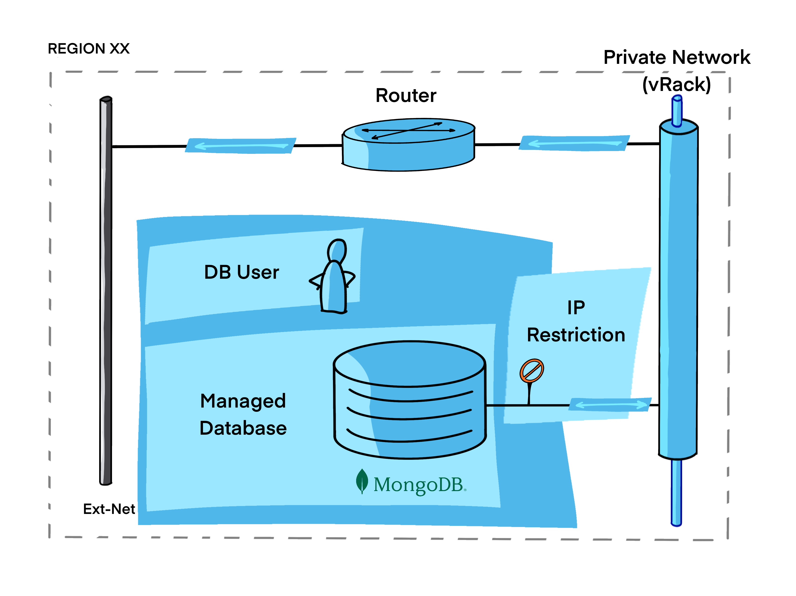
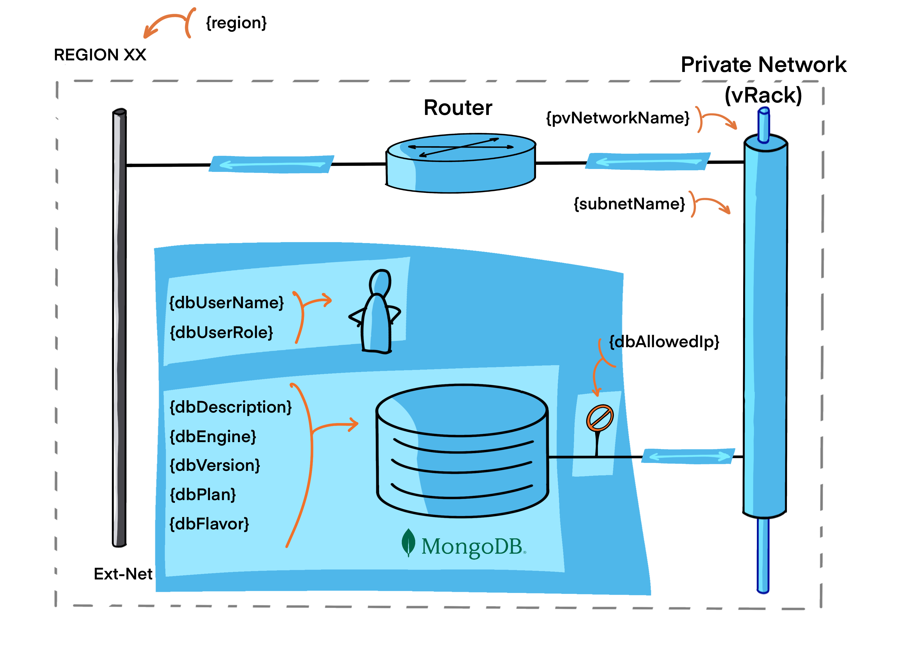

# Managed MongoDb database with private network

This example builds a Managed MongoDb database connected to a private network within OVHcloud Public Cloud.

The components that will be created are : 

- A [Managed MongoDb database](https://www.ovhcloud.com/en/public-cloud/mongodb)



## Pre-requisites

You need to follow steps from the [basics tutorial](../../basics/README.md) for having necessary tools and a fonctionnal `ovhrc` file.

You need to have a functional routed private network. If not read and apply the [Simple private network](../../networking/private-network-mono-region/README.md) tutorial.

## properties files

This is the parameters needed by the scripts:



Edit the `variables.tf` file to modify values:

```terraform

```

## Create

Create the MongoDb database with this commands:

```bash
source ovhrc
terraform init
terraform plan
terraform apply
```

Or simply use the `createDb.sh` script.

```bash
./createDb.sh
```

<details><summary>See output</summary>

```bash

```

</details>

## Delete / Purge

Clean you environment with this commands:

```bash
source ovhrc
terraform destroy --auto-approve
```

Or execute the `deleteDb.sh` script:

```bash
./deleteDb.sh
```

<details><summary>See output</summary>

```bash

```

</details>


