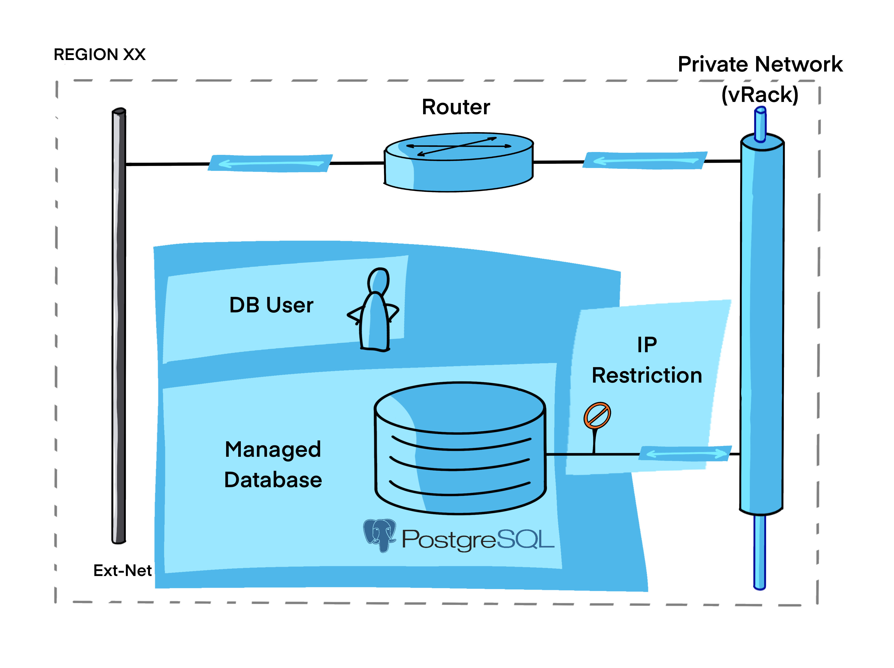
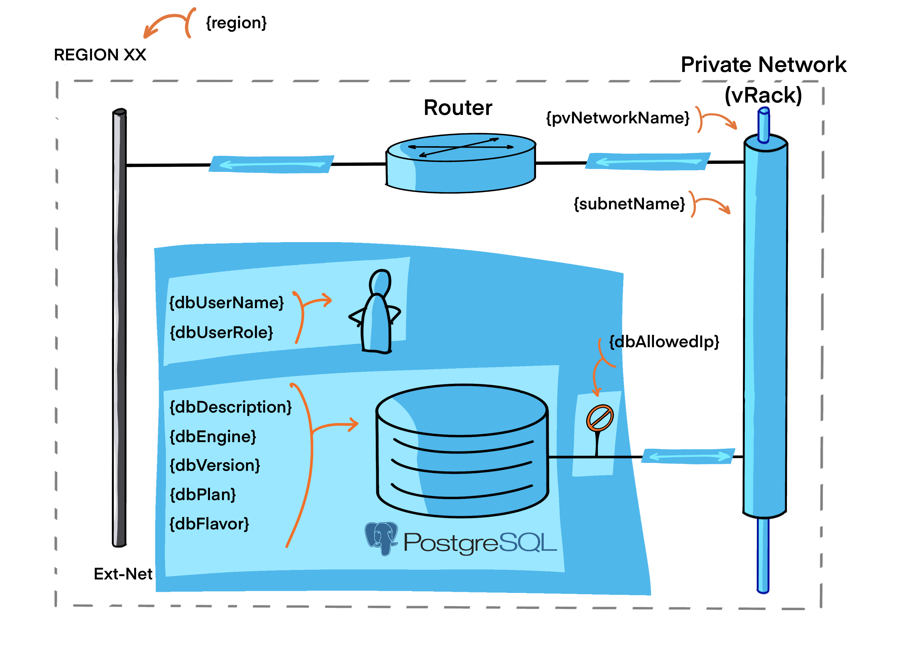

# Managed PostgreSQL database with private network

This example builds a Managed PostgreSQL database connected to a private network within OVHcloud Public Cloud.

The components that will be created are :

- A [Managed PostgreSQL database](https://www.ovhcloud.com/en/public-cloud/postgresql).

- A database user with the replication role.

- An IP restriction rule that allows the access to the database from the private network.



## Pre-requisites

You need to follow steps from the [basics tutorial](../../basics/README.md) for having necessary tools and a fonctionnal `ovhrc` file.

You need to have a functional routed private network. If not read and apply the [Simple private network](../../networking/private-network-mono-region/README.md) tutorial.

## properties files

This is the parameters needed by the scripts:



Edit the `variables.auto.tfvars` file to modify values:

```terraform
// Region

region = "GRA7"

// Region for database

db_egion = "GRA"

// Network - Private Network

pv_network_name = "my_private_network"

// Network - Subnet

subnet_name = "my_subnet"

// Database

db_description = "myPgSqlDb"
db_engine = "postgresql"
db_version = "14"
db_plan = "business"
db_flavor = "db1-7"

// Database User

db_user_name = "myuser"
db_user_role = ["replication"]

// IP Restriction

db_allowed_ip = "192.168.2.0/24"
```

## Create

Create the PostgreSQL database with this commands:

```bash
source ovhrc
terraform init
terraform plan
terraform apply
```

Or simply use the `createDb.sh` script.

```bash
./createDb.sh
```

<details><summary>See output</summary>

```bash
Initializing the backend...

Initializing provider plugins...
- Reusing previous version of terraform-provider-openstack/openstack from the dependency lock file
- Reusing previous version of ovh/ovh from the dependency lock file
- Using previously-installed ovh/ovh v0.23.0
- Using previously-installed terraform-provider-openstack/openstack v1.35.0

Terraform has been successfully initialized!

You may now begin working with Terraform. Try running "terraform plan" to see
any changes that are required for your infrastructure. All Terraform commands
should now work.

If you ever set or change modules or backend configuration for Terraform,
rerun this command to reinitialize your working directory. If you forget, other
commands will detect it and remind you to do so if necessary.
data.openstack_networking_network_v2.my_private_network: Reading...
data.openstack_networking_subnet_v2.my_subnet: Reading...
data.openstack_networking_network_v2.my_private_network: Read complete after 1s [id=xxxxxxxx-d430-4c31-8e2d-xxxxxxxxxxxx]
data.openstack_networking_subnet_v2.my_subnet: Read complete after 1s [id=xxxxxxxx-78ac-4a1b-af85-xxxxxxxxxxxx]

Terraform used the selected providers to generate the following execution plan. Resource actions are indicated
with the following symbols:
  + create

Terraform will perform the following actions:

  # ovh_cloud_project_database.pgsqldb will be created
  + resource "ovh_cloud_project_database" "pgsqldb" {
      + backup_time      = (known after apply)
      + created_at       = (known after apply)
      + description      = "myPgSqlDb"
      + disk_size        = 160
      + disk_type        = (known after apply)
      + endpoints        = (known after apply)
      + engine           = "postgresql"
      + flavor           = "db1-7"
      + id               = (known after apply)
      + maintenance_time = (known after apply)
      + network_type     = (known after apply)
      + plan             = "business"
      + service_name     = "xxxxxxxx1da24017a6a6f6b6xxxxxxxx"
      + status           = (known after apply)
      + version          = "14"

      + nodes {
          + network_id = "xxxxxxxx-d430-4c31-8e2d-xxxxxxxxxxxx"
          + region     = "GRA"
          + subnet_id  = "xxxxxxxx-78ac-4a1b-af85-xxxxxxxxxxxx"
        }
      + nodes {
          + network_id = "xxxxxxxx-d430-4c31-8e2d-xxxxxxxxxxxx"
          + region     = "GRA"
          + subnet_id  = "xxxxxxxx-78ac-4a1b-af85-xxxxxxxxxxxx"
        }
    }

  # ovh_cloud_project_database_ip_restriction.iprestriction will be created
  + resource "ovh_cloud_project_database_ip_restriction" "iprestriction" {
      + cluster_id   = (known after apply)
      + engine       = "postgresql"
      + id           = (known after apply)
      + ip           = "192.168.2.0/24"
      + service_name = "xxxxxxxx1da24017a6a6f6b6xxxxxxxx"
      + status       = (known after apply)
    }

  # ovh_cloud_project_database_postgresql_user.pgsqluser will be created
  + resource "ovh_cloud_project_database_postgresql_user" "pgsqluser" {
      + cluster_id     = (known after apply)
      + created_at     = (known after apply)
      + id             = (known after apply)
      + name           = "myuser"
      + password       = (sensitive value)
      + password_reset = "changeMeToResetPassword1"
      + roles          = [
          + "replication",
        ]
      + service_name   = "xxxxxxxx1da24017a6a6f6b6xxxxxxxx"
      + status         = (known after apply)
    }

Plan: 3 to add, 0 to change, 0 to destroy.

Changes to Outputs:
  + db_id           = (known after apply)
  + db_user_password = (sensitive value)
  + service_name    = "xxxxxxxx1da24017a6a6f6b6xxxxxxxx"

──────────────────────────────────────────────────────────────────────────────────────────────────────────────

Note: You didn't use the -out option to save this plan, so Terraform can't guarantee to take exactly these
actions if you run "terraform apply" now.
data.openstack_networking_subnet_v2.my_subnet: Reading...
data.openstack_networking_network_v2.my_private_network: Reading...
data.openstack_networking_subnet_v2.my_subnet: Read complete after 1s [id=xxxxxxxx-78ac-4a1b-af85-xxxxxxxxxxxx]
data.openstack_networking_network_v2.my_private_network: Read complete after 2s [id=xxxxxxxx-d430-4c31-8e2d-xxxxxxxxxxxx]

Terraform used the selected providers to generate the following execution plan. Resource actions are indicated
with the following symbols:
  + create

Terraform will perform the following actions:

  # ovh_cloud_project_database.pgsqldb will be created
  + resource "ovh_cloud_project_database" "pgsqldb" {
      + backup_time      = (known after apply)
      + created_at       = (known after apply)
      + description      = "myPgSqlDb"
      + disk_size        = 160
      + disk_type        = (known after apply)
      + endpoints        = (known after apply)
      + engine           = "postgresql"
      + flavor           = "db1-7"
      + id               = (known after apply)
      + maintenance_time = (known after apply)
      + network_type     = (known after apply)
      + plan             = "business"
      + service_name     = "xxxxxxxx1da24017a6a6f6b6xxxxxxxx"
      + status           = (known after apply)
      + version          = "14"

      + nodes {
          + network_id = "xxxxxxxx-d430-4c31-8e2d-xxxxxxxxxxxx"
          + region     = "GRA"
          + subnet_id  = "xxxxxxxx-78ac-4a1b-af85-xxxxxxxxxxxx"
        }
      + nodes {
          + network_id = "xxxxxxxx-d430-4c31-8e2d-xxxxxxxxxxxx"
          + region     = "GRA"
          + subnet_id  = "xxxxxxxx-78ac-4a1b-af85-xxxxxxxxxxxx"
        }
    }

  # ovh_cloud_project_database_ip_restriction.iprestriction will be created
  + resource "ovh_cloud_project_database_ip_restriction" "iprestriction" {
      + cluster_id   = (known after apply)
      + engine       = "postgresql"
      + id           = (known after apply)
      + ip           = "192.168.2.0/24"
      + service_name = "xxxxxxxx1da24017a6a6f6b6xxxxxxxx"
      + status       = (known after apply)
    }

  # ovh_cloud_project_database_postgresql_user.pgsqluser will be created
  + resource "ovh_cloud_project_database_postgresql_user" "pgsqluser" {
      + cluster_id     = (known after apply)
      + created_at     = (known after apply)
      + id             = (known after apply)
      + name           = "myuser"
      + password       = (sensitive value)
      + password_reset = "changeMeToResetPassword1"
      + roles          = [
          + "replication",
        ]
      + service_name   = "xxxxxxxx1da24017a6a6f6b6xxxxxxxx"
      + status         = (known after apply)
    }

Plan: 3 to add, 0 to change, 0 to destroy.

Changes to Outputs:
  + db_id           = (known after apply)
  + db_user_password = (sensitive value)
  + service_name    = "xxxxxxxx1da24017a6a6f6b6xxxxxxxx"
ovh_cloud_project_database.pgsqldb: Creating...
ovh_cloud_project_database.pgsqldb: Still creating... [10s elapsed]
ovh_cloud_project_database.pgsqldb: Still creating... [20s elapsed]
ovh_cloud_project_database.pgsqldb: Still creating... [30s elapsed]
ovh_cloud_project_database.pgsqldb: Still creating... [40s elapsed]
ovh_cloud_project_database.pgsqldb: Still creating... [50s elapsed]
ovh_cloud_project_database.pgsqldb: Still creating... [1m0s elapsed]
ovh_cloud_project_database.pgsqldb: Still creating... [1m10s elapsed]
ovh_cloud_project_database.pgsqldb: Still creating... [1m20s elapsed]
ovh_cloud_project_database.pgsqldb: Still creating... [1m30s elapsed]
ovh_cloud_project_database.pgsqldb: Still creating... [1m40s elapsed]
ovh_cloud_project_database.pgsqldb: Still creating... [1m50s elapsed]
ovh_cloud_project_database.pgsqldb: Still creating... [2m0s elapsed]
ovh_cloud_project_database.pgsqldb: Still creating... [2m10s elapsed]
ovh_cloud_project_database.pgsqldb: Still creating... [2m20s elapsed]
ovh_cloud_project_database.pgsqldb: Still creating... [2m30s elapsed]
ovh_cloud_project_database.pgsqldb: Still creating... [2m40s elapsed]
ovh_cloud_project_database.pgsqldb: Still creating... [2m50s elapsed]
ovh_cloud_project_database.pgsqldb: Still creating... [3m0s elapsed]
ovh_cloud_project_database.pgsqldb: Still creating... [3m10s elapsed]
ovh_cloud_project_database.pgsqldb: Still creating... [3m20s elapsed]
ovh_cloud_project_database.pgsqldb: Still creating... [3m30s elapsed]
ovh_cloud_project_database.pgsqldb: Still creating... [3m40s elapsed]
ovh_cloud_project_database.pgsqldb: Still creating... [3m50s elapsed]
ovh_cloud_project_database.pgsqldb: Still creating... [4m0s elapsed]
ovh_cloud_project_database.pgsqldb: Still creating... [4m10s elapsed]
ovh_cloud_project_database.pgsqldb: Still creating... [4m20s elapsed]
ovh_cloud_project_database.pgsqldb: Still creating... [4m30s elapsed]
ovh_cloud_project_database.pgsqldb: Still creating... [4m40s elapsed]
ovh_cloud_project_database.pgsqldb: Still creating... [4m50s elapsed]
ovh_cloud_project_database.pgsqldb: Still creating... [5m0s elapsed]
ovh_cloud_project_database.pgsqldb: Still creating... [5m10s elapsed]
ovh_cloud_project_database.pgsqldb: Still creating... [5m20s elapsed]
ovh_cloud_project_database.pgsqldb: Still creating... [5m30s elapsed]
ovh_cloud_project_database.pgsqldb: Still creating... [5m40s elapsed]
ovh_cloud_project_database.pgsqldb: Still creating... [5m50s elapsed]
ovh_cloud_project_database.pgsqldb: Still creating... [6m0s elapsed]
ovh_cloud_project_database.pgsqldb: Still creating... [6m10s elapsed]
ovh_cloud_project_database.pgsqldb: Still creating... [6m20s elapsed]
ovh_cloud_project_database.pgsqldb: Still creating... [6m30s elapsed]
ovh_cloud_project_database.pgsqldb: Still creating... [6m40s elapsed]
ovh_cloud_project_database.pgsqldb: Still creating... [6m50s elapsed]
ovh_cloud_project_database.pgsqldb: Still creating... [7m0s elapsed]
ovh_cloud_project_database.pgsqldb: Still creating... [7m10s elapsed]
ovh_cloud_project_database.pgsqldb: Still creating... [7m20s elapsed]
ovh_cloud_project_database.pgsqldb: Still creating... [7m30s elapsed]
ovh_cloud_project_database.pgsqldb: Still creating... [7m40s elapsed]
ovh_cloud_project_database.pgsqldb: Still creating... [7m50s elapsed]
ovh_cloud_project_database.pgsqldb: Still creating... [8m0s elapsed]
ovh_cloud_project_database.pgsqldb: Still creating... [8m10s elapsed]
ovh_cloud_project_database.pgsqldb: Still creating... [8m20s elapsed]
ovh_cloud_project_database.pgsqldb: Still creating... [8m30s elapsed]
ovh_cloud_project_database.pgsqldb: Still creating... [8m40s elapsed]
ovh_cloud_project_database.pgsqldb: Still creating... [8m50s elapsed]
ovh_cloud_project_database.pgsqldb: Still creating... [9m0s elapsed]
ovh_cloud_project_database.pgsqldb: Still creating... [9m10s elapsed]
ovh_cloud_project_database.pgsqldb: Still creating... [9m20s elapsed]
ovh_cloud_project_database.pgsqldb: Still creating... [9m30s elapsed]
ovh_cloud_project_database.pgsqldb: Still creating... [9m40s elapsed]
ovh_cloud_project_database.pgsqldb: Still creating... [9m50s elapsed]
ovh_cloud_project_database.pgsqldb: Still creating... [10m0s elapsed]
ovh_cloud_project_database.pgsqldb: Still creating... [10m10s elapsed]
ovh_cloud_project_database.pgsqldb: Still creating... [10m20s elapsed]
ovh_cloud_project_database.pgsqldb: Still creating... [10m30s elapsed]
ovh_cloud_project_database.pgsqldb: Creation complete after 10m35s [id=xxxxxxxx-c804-446a-995c-xxxxxxxxxxxx]
ovh_cloud_project_database_ip_restriction.iprestriction: Creating...
ovh_cloud_project_database_postgresql_user.pgsqluser: Creating...
ovh_cloud_project_database_ip_restriction.iprestriction: Still creating... [10s elapsed]
ovh_cloud_project_database_postgresql_user.pgsqluser: Still creating... [10s elapsed]
ovh_cloud_project_database_postgresql_user.pgsqluser: Creation complete after 11s [id=xxxxxxxx-73fc-4d44-a737-xxxxxxxxxxxxx]
ovh_cloud_project_database_ip_restriction.iprestriction: Creation complete after 11s [id=xxx4843xxx]

Apply complete! Resources: 3 added, 0 changed, 0 destroyed.

Outputs:

db_id = "xxxxxxxx-c804-446a-995c-xxxxxxxxxxxx"
db_user_password = <sensitive>
service_name = "xxxxxxxx1da24017a6a6f6b6xxxxxxxx"
```

</details>

## Get current user password

```bash
terraform output db_user_password
```

## Reset current user password

Open and edit the `resources.tf` file and change the value of the `password_reset` parameter, from the `ovh_cloud_project_database_postgresql_user` resource block.

Then, re-apply the plan to perform a password resseti and get the new one with:

```bash
terraform apply
terraform output db_user_password
```

<details><summary>See output</summary>

```bash
data.openstack_networking_network_v2.my_private_network: Reading...
data.openstack_networking_subnet_v2.my_subnet: Reading...
data.openstack_networking_subnet_v2.my_subnet: Read complete after 2s [id=xxxxxxxx-78ac-4a1b-af85-xxxxxxxxxxxx]
data.openstack_networking_network_v2.my_private_network: Read complete after 2s [id=xxxxxxxx-d430-4c31-8e2d-xxxxxxxxxxxx]
ovh_cloud_project_database.pgsqldb: Refreshing state... [id=xxxxxxxx-c804-446a-995c-xxxxxxxxxxxx]
ovh_cloud_project_database_ip_restriction.iprestriction: Refreshing state... [id=xxx4843xxx]
ovh_cloud_project_database_postgresql_user.pgsqluser: Refreshing state... [id=xxxxxxxx-73fc-4d44-a737-xxxxxxxxxxxxx]

Terraform used the selected providers to generate the following execution plan. Resource actions are indicated
with the following symbols:
  ~ update in-place

Terraform will perform the following actions:

  # ovh_cloud_project_database_postgresql_user.pgsqluser will be updated in-place
  ~ resource "ovh_cloud_project_database_postgresql_user" "pgsqluser" {
        id             = "xxxxxxxx-73fc-4d44-a737-xxxxxxxxxxxxx"
        name           = "myuser"
      ~ password_reset = "changeMeToResetPassword1" -> "changeMeToResetPassword"
      ~ roles          = [
          + "replication",
        ]
        # (5 unchanged attributes hidden)
    }

Plan: 0 to add, 1 to change, 0 to destroy.

Do you want to perform these actions?
  Terraform will perform the actions described above.
  Only 'yes' will be accepted to approve.

  Enter a value: yes

ovh_cloud_project_database_postgresql_user.pgsqluser: Modifying... [id=xxxxxxxx-73fc-4d44-a737-xxxxxxxxxxxxx]
ovh_cloud_project_database_postgresql_user.pgsqluser: Still modifying... [id=xxxxxxxx-73fc-4d44-a737-xxxxxxxxxxxxx, 10s elapsed]
ovh_cloud_project_database_postgresql_user.pgsqluser: Still modifying... [id=xxxxxxxx-73fc-4d44-a737-xxxxxxxxxxxxx, 20s elapsed]
ovh_cloud_project_database_postgresql_user.pgsqluser: Modifications complete after 22s [id=xxxxxxxx-73fc-4d44-a737-xxxxxxxxxxxxx]

Apply complete! Resources: 0 added, 1 changed, 0 destroyed.

Outputs:

db_id = "xxxxxxxx-c804-446a-995c-xxxxxxxxxxxx"
db_user_password = <sensitive>
service_name = "xxxxxxxx1da24017a6a6f6b6xxxxxxxx"
```

</details>

## Delete / Purge

Clean you environment with this commands:

```bash
source ovhrc
terraform destroy --auto-approve
```

Or execute the `deleteDb.sh` script:

```bash
./deleteDb.sh
```

<details><summary>See output</summary>

```bash
data.openstack_networking_network_v2.my_private_network: Reading...
data.openstack_networking_subnet_v2.my_subnet: Reading...
data.openstack_networking_subnet_v2.my_subnet: Read complete after 1s [id=xxxxxxxx-78ac-4a1b-af85-xxxxxxxxxxxx]
data.openstack_networking_network_v2.my_private_network: Read complete after 2s [id=xxxxxxxx-d430-4c31-8e2d-xxxxxxxxxxxx]
ovh_cloud_project_database.pgsqldb: Refreshing state... [id=xxxxxxxx-c804-446a-995c-xxxxxxxxxxxx]
ovh_cloud_project_database_ip_restriction.iprestriction: Refreshing state... [id=xxx4843xxx]
ovh_cloud_project_database_postgresql_user.pgsqluser: Refreshing state... [id=xxxxxxxx-73fc-4d44-a737-xxxxxxxxxxxxx]

Terraform used the selected providers to generate the following execution plan. Resource actions are indicated
with the following symbols:
  - destroy

Terraform will perform the following actions:

  # ovh_cloud_project_database.pgsqldb will be destroyed
  - resource "ovh_cloud_project_database" "pgsqldb" {
      - backup_time             = "03:25:00" -> null
      - created_at              = "2022-11-29T15:41:06.256214+01:00" -> null
      - description             = "myPgSqlDb" -> null
      - disk_size               = 160 -> null
      - disk_type               = "high-speed" -> null
      - endpoints               = [
          - {
              - component = "postgresql"
              - domain    = "postgresql-xxxxxxxx-obf0d5312.database.cloud.ovh.net"
              - path      = ""
              - port      = 20184
              - scheme    = "postgres"
              - ssl       = true
              - ssl_mode  = "require"
              - uri       = "postgres://<username>:<password>@postgresql-xxxxxxxx-obf0d5312.database.cloud.ovh.net:20184/defaultdb?sslmode=require"
            },
          - {
              - component = "postgresqlRead"
              - domain    = "replica-postgresql-xxxxxxxx-obf0d5312.database.cloud.ovh.net"
              - path      = ""
              - port      = 20184
              - scheme    = "postgres"
              - ssl       = true
              - ssl_mode  = "require"
              - uri       = "postgres://<username>:<password>@replica-postgresql-xxxxxxxx-obf0d5312.database.cloud.ovh.net:20184/defaultdb?sslmode=require"
            },
        ] -> null
      - engine                  = "postgresql" -> null
      - flavor                  = "db1-7" -> null
      - id                      = "xxxxxxxx-c804-446a-995c-xxxxxxxxxxxx" -> null
      - kafka_rest_api          = false -> null
      - maintenance_time        = "01:06:04" -> null
      - network_type            = "private" -> null
      - opensearch_acls_enabled = false -> null
      - plan                    = "business" -> null
      - service_name            = "xxxxxxxx1da24017a6a6f6b6xxxxxxxx" -> null
      - status                  = "READY" -> null
      - version                 = "14" -> null

      - nodes {
          - network_id = "xxxxxxxx-d430-4c31-8e2d-xxxxxxxxxxxx" -> null
          - region     = "GRA" -> null
          - subnet_id  = "xxxxxxxx-78ac-4a1b-af85-xxxxxxxxxxxx" -> null
        }
      - nodes {
          - network_id = "xxxxxxxx-d430-4c31-8e2d-xxxxxxxxxxxx" -> null
          - region     = "GRA" -> null
          - subnet_id  = "xxxxxxxx-78ac-4a1b-af85-xxxxxxxxxxxx" -> null
        }
    }

  # ovh_cloud_project_database_ip_restriction.iprestriction will be destroyed
  - resource "ovh_cloud_project_database_ip_restriction" "iprestriction" {
      - cluster_id   = "xxxxxxxx-c804-446a-995c-xxxxxxxxxxxx" -> null
      - engine       = "postgresql" -> null
      - id           = "xxx4843xxx" -> null
      - ip           = "192.168.2.0/24" -> null
      - service_name = "xxxxxxxx1da24017a6a6f6b6xxxxxxxx" -> null
      - status       = "READY" -> null
    }

  # ovh_cloud_project_database_postgresql_user.pgsqluser will be destroyed
  - resource "ovh_cloud_project_database_postgresql_user" "pgsqluser" {
      - cluster_id     = "xxxxxxxx-c804-446a-995c-xxxxxxxxxxxx" -> null
      - created_at     = "2022-11-29T15:51:41.387898+01:00" -> null
      - id             = "xxxxxxxx-73fc-4d44-a737-xxxxxxxxxxxxx" -> null
      - name           = "myuser" -> null
      - password       = (sensitive value)
      - password_reset = "changeMeToResetPassword" -> null
      - roles          = [
          - "replication",
        ] -> null
      - service_name   = "xxxxxxxx1da24017a6a6f6b6xxxxxxxx" -> null
      - status         = "READY" -> null
    }

Plan: 0 to add, 0 to change, 3 to destroy.

Changes to Outputs:
  - db_id           = "xxxxxxxx-c804-446a-995c-xxxxxxxxxxxx" -> null
  - db_user_password = (sensitive value)
  - service_name    = "xxxxxxxx1da24017a6a6f6b6xxxxxxxx" -> null
ovh_cloud_project_database_ip_restriction.iprestriction: Destroying... [id=xxx4843xxx]
ovh_cloud_project_database_postgresql_user.pgsqluser: Destroying... [id=xxxxxxxx-73fc-4d44-a737-xxxxxxxxxxxxx]
ovh_cloud_project_database_ip_restriction.iprestriction: Still destroying... [id=xxx4843xxx, 10s elapsed]
ovh_cloud_project_database_postgresql_user.pgsqluser: Still destroying... [id=xxxxxxxx-73fc-4d44-a737-xxxxxxxxxxxxx, 10s elapsed]
ovh_cloud_project_database_postgresql_user.pgsqluser: Destruction complete after 13s
ovh_cloud_project_database_ip_restriction.iprestriction: Destruction complete after 13s
ovh_cloud_project_database.pgsqldb: Destroying... [id=xxxxxxxx-c804-446a-995c-xxxxxxxxxxxx]
ovh_cloud_project_database.pgsqldb: Still destroying... [id=xxxxxxxx-c804-446a-995c-xxxxxxxxxxxx, 10s elapsed]
ovh_cloud_project_database.pgsqldb: Still destroying... [id=xxxxxxxx-c804-446a-995c-xxxxxxxxxxxx, 20s elapsed]
ovh_cloud_project_database.pgsqldb: Still destroying... [id=xxxxxxxx-c804-446a-995c-xxxxxxxxxxxx, 30s elapsed]
ovh_cloud_project_database.pgsqldb: Destruction complete after 32s

Destroy complete! Resources: 3 destroyed.
```

</details>
