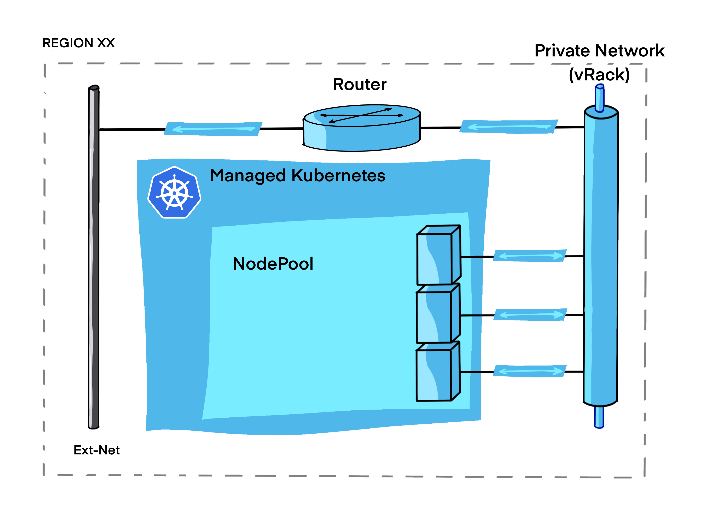
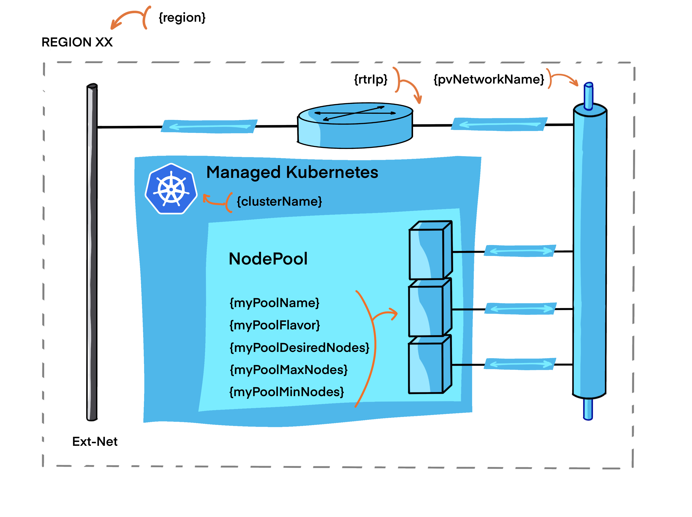

# Managed Kubernetes Cluster with private network

This example builds a Managed Kubernetes Cluster connected to a private network within OVHcloud Public Cloud.

The components that will be created are : 

- A [Managed Kubernetes Cluster](https://www.ovhcloud.com/en/public-cloud/kubernetes)

- A Node pool



## Pre-requisites

You need to follow steps from the [basics tutorial](../../basics/README.md) for having necessary tools and a fonctionnal `ovhrc` file.

You need to have a functional routed private network. If not read and apply the [Simple private network](../../networking/private-network-mono-region/README.md) tutorial.

## properties files

This is the parameters needed by the scripts:



Edit the `variables.tf` file to modify values:

```terraform
// Openstack project Id

variable "serviceName" {
 type           = string
}


// Kubernetes Cluster Name

variable "clusterName" {
 type           = string
 default        = "myKubernetesCluster"
}

// Region

variable "region" {
 type           = string
 default        = "GRA7"
}

// Network - Private Network

variable "pvNetworkName" {
 type           = string
 default        = "myPrivateNetwork"
}

variable "rtrIp" {
 type           = string
 default        = "192.168.2.1"
}

// Node Pool definition

variable "myPoolName" {
 type           = string
 default        = "mypool"
}

variable "myPoolFlavor" {
 type           = string
 default        = "b2-7"
}

variable "myPoolDesiredNodes" {
 type           = string
 default        = "3"
}

variable "myPoolMaxNodes" {
 type           = string
 default        = "6"
}

variable "myPoolMinNodes" {
 type           = string
 default        = "3"
}
```

## Create

Create the network environment with this commands:

```bash
source ovhrc
terraform init
terraform plan
terraform apply
```

Or simply use the `createCluster.sh` script.

```bash
./createCluster.sh
```

<details><summary>See output</summary>

```bash
Initializing the backend...

Initializing provider plugins...
- Finding latest version of ovh/ovh...
- Finding terraform-provider-openstack/openstack versions matching "~> 1.35.0"...
- Installing ovh/ovh v0.23.0...
- Installed ovh/ovh v0.23.0 (signed by a HashiCorp partner, key ID F56D1A6CBDAAADA5)
- Installing terraform-provider-openstack/openstack v1.35.0...
- Installed terraform-provider-openstack/openstack v1.35.0 (self-signed, key ID 4F80527A391BEFD2)

Partner and community providers are signed by their developers.
If you'd like to know more about provider signing, you can read about it here:
https://www.terraform.io/docs/cli/plugins/signing.html

Terraform has created a lock file .terraform.lock.hcl to record the provider
selections it made above. Include this file in your version control repository
so that Terraform can guarantee to make the same selections by default when
you run "terraform init" in the future.

Terraform has been successfully initialized!

You may now begin working with Terraform. Try running "terraform plan" to see
any changes that are required for your infrastructure. All Terraform commands
should now work.

If you ever set or change modules or backend configuration for Terraform,
rerun this command to reinitialize your working directory. If you forget, other
commands will detect it and remind you to do so if necessary.
data.openstack_networking_network_v2.myPrivateNetwork: Reading...
data.openstack_networking_network_v2.myPrivateNetwork: Read complete after 3s [id=xxxxxxxx-d430-4c31-8e2d-xxxxxxxxxxxx]

Terraform used the selected providers to generate the following execution plan. Resource actions are indicated with the following symbols:
  + create

Terraform will perform the following actions:

  # ovh_cloud_project_kube.myKube will be created
  + resource "ovh_cloud_project_kube" "myKube" {
      + control_plane_is_up_to_date = (known after apply)
      + id                          = (known after apply)
      + is_up_to_date               = (known after apply)
      + kubeconfig                  = (sensitive value)
      + name                        = "myKubernetesCluster"
      + next_upgrade_versions       = (known after apply)
      + nodes_url                   = (known after apply)
      + private_network_id          = "xxxxxxxx-d430-4c31-8e2d-xxxxxxxxxxxx"
      + region                      = "GRA7"
      + service_name                = "xxxxxxxx1da24017a6a6f6b6xxxxxxxx"
      + status                      = (known after apply)
      + update_policy               = (known after apply)
      + url                         = (known after apply)
      + version                     = (known after apply)

      + customization {
          + apiserver {
              + admissionplugins {
                  + disabled = (known after apply)
                  + enabled  = (known after apply)
                }
            }
        }

      + private_network_configuration {
          + default_vrack_gateway              = "192.168.2.1"
          + private_network_routing_as_default = true
        }
    }

  # ovh_cloud_project_kube_nodepool.myPool will be created
  + resource "ovh_cloud_project_kube_nodepool" "myPool" {
      + anti_affinity    = false
      + autoscale        = false
      + available_nodes  = (known after apply)
      + created_at       = (known after apply)
      + current_nodes    = (known after apply)
      + desired_nodes    = 3
      + flavor           = (known after apply)
      + flavor_name      = "b2-7"
      + id               = (known after apply)
      + kube_id          = (known after apply)
      + max_nodes        = 6
      + min_nodes        = 3
      + monthly_billed   = false
      + name             = "mypool"
      + project_id       = (known after apply)
      + service_name     = "xxxxxxxx1da24017a6a6f6b6xxxxxxxx"
      + size_status      = (known after apply)
      + status           = (known after apply)
      + up_to_date_nodes = (known after apply)
      + updated_at       = (known after apply)
    }

Plan: 2 to add, 0 to change, 0 to destroy.

Changes to Outputs:
  + kubeClusterId = (known after apply)
  + nodePoolId    = (known after apply)
  + serviceName   = "xxxxxxxx1da24017a6a6f6b6xxxxxxxx"

───────────────────────────────────────────────────────────────────────────────────────────────────────────────────────────────────────────────────────────────────────────────────────────────────────────────────

Note: You didn't use the -out option to save this plan, so Terraform can't guarantee to take exactly these actions if you run "terraform apply" now.
data.openstack_networking_network_v2.myPrivateNetwork: Reading...
data.openstack_networking_network_v2.myPrivateNetwork: Read complete after 2s [id=xxxxxxxx-d430-4c31-8e2d-xxxxxxxxxxxx]

Terraform used the selected providers to generate the following execution plan. Resource actions are indicated with the following symbols:
  + create

Terraform will perform the following actions:

  # ovh_cloud_project_kube.myKube will be created
  + resource "ovh_cloud_project_kube" "myKube" {
      + control_plane_is_up_to_date = (known after apply)
      + id                          = (known after apply)
      + is_up_to_date               = (known after apply)
      + kubeconfig                  = (sensitive value)
      + name                        = "myKubernetesCluster"
      + next_upgrade_versions       = (known after apply)
      + nodes_url                   = (known after apply)
      + private_network_id          = "xxxxxxxx-d430-4c31-8e2d-xxxxxxxxxxxx"
      + region                      = "GRA7"
      + service_name                = "xxxxxxxx1da24017a6a6f6b6xxxxxxxx"
      + status                      = (known after apply)
      + update_policy               = (known after apply)
      + url                         = (known after apply)
      + version                     = (known after apply)

      + customization {
          + apiserver {
              + admissionplugins {
                  + disabled = (known after apply)
                  + enabled  = (known after apply)
                }
            }
        }

      + private_network_configuration {
          + default_vrack_gateway              = "192.168.2.1"
          + private_network_routing_as_default = true
        }
    }

  # ovh_cloud_project_kube_nodepool.myPool will be created
  + resource "ovh_cloud_project_kube_nodepool" "myPool" {
      + anti_affinity    = false
      + autoscale        = false
      + available_nodes  = (known after apply)
      + created_at       = (known after apply)
      + current_nodes    = (known after apply)
      + desired_nodes    = 3
      + flavor           = (known after apply)
      + flavor_name      = "b2-7"
      + id               = (known after apply)
      + kube_id          = (known after apply)
      + max_nodes        = 6
      + min_nodes        = 3
      + monthly_billed   = false
      + name             = "mypool"
      + project_id       = (known after apply)
      + service_name     = "xxxxxxxx1da24017a6a6f6b6xxxxxxxx"
      + size_status      = (known after apply)
      + status           = (known after apply)
      + up_to_date_nodes = (known after apply)
      + updated_at       = (known after apply)
    }

Plan: 2 to add, 0 to change, 0 to destroy.

Changes to Outputs:
  + kubeClusterId = (known after apply)
  + nodePoolId    = (known after apply)
  + serviceName   = "xxxxxxxx1da24017a6a6f6b6xxxxxxxx"
ovh_cloud_project_kube.myKube: Creating...
ovh_cloud_project_kube.myKube: Still creating... [10s elapsed]
ovh_cloud_project_kube.myKube: Still creating... [20s elapsed]
ovh_cloud_project_kube.myKube: Still creating... [30s elapsed]
ovh_cloud_project_kube.myKube: Still creating... [40s elapsed]
ovh_cloud_project_kube.myKube: Still creating... [50s elapsed]
ovh_cloud_project_kube.myKube: Still creating... [1m0s elapsed]
ovh_cloud_project_kube.myKube: Still creating... [1m10s elapsed]
ovh_cloud_project_kube.myKube: Still creating... [1m20s elapsed]
ovh_cloud_project_kube.myKube: Still creating... [1m30s elapsed]
ovh_cloud_project_kube.myKube: Still creating... [1m40s elapsed]
ovh_cloud_project_kube.myKube: Still creating... [1m50s elapsed]
ovh_cloud_project_kube.myKube: Still creating... [2m0s elapsed]
ovh_cloud_project_kube.myKube: Still creating... [2m10s elapsed]
ovh_cloud_project_kube.myKube: Still creating... [2m20s elapsed]
ovh_cloud_project_kube.myKube: Still creating... [2m30s elapsed]
ovh_cloud_project_kube.myKube: Still creating... [2m40s elapsed]
ovh_cloud_project_kube.myKube: Still creating... [2m50s elapsed]
ovh_cloud_project_kube.myKube: Still creating... [3m0s elapsed]
ovh_cloud_project_kube.myKube: Still creating... [3m10s elapsed]
ovh_cloud_project_kube.myKube: Still creating... [3m20s elapsed]
ovh_cloud_project_kube.myKube: Still creating... [3m30s elapsed]
ovh_cloud_project_kube.myKube: Still creating... [3m40s elapsed]
ovh_cloud_project_kube.myKube: Creation complete after 3m46s [id=xxxxxxxx-28b8-47c6-8ad2-xxxxxxxxxxxx]
ovh_cloud_project_kube_nodepool.myPool: Creating...
ovh_cloud_project_kube_nodepool.myPool: Still creating... [10s elapsed]
ovh_cloud_project_kube_nodepool.myPool: Still creating... [20s elapsed]
ovh_cloud_project_kube_nodepool.myPool: Still creating... [30s elapsed]
ovh_cloud_project_kube_nodepool.myPool: Still creating... [40s elapsed]
ovh_cloud_project_kube_nodepool.myPool: Still creating... [50s elapsed]
ovh_cloud_project_kube_nodepool.myPool: Still creating... [1m0s elapsed]
ovh_cloud_project_kube_nodepool.myPool: Still creating... [1m10s elapsed]
ovh_cloud_project_kube_nodepool.myPool: Still creating... [1m20s elapsed]
ovh_cloud_project_kube_nodepool.myPool: Still creating... [1m30s elapsed]
ovh_cloud_project_kube_nodepool.myPool: Still creating... [1m40s elapsed]
ovh_cloud_project_kube_nodepool.myPool: Still creating... [1m50s elapsed]
ovh_cloud_project_kube_nodepool.myPool: Still creating... [2m0s elapsed]
ovh_cloud_project_kube_nodepool.myPool: Still creating... [2m10s elapsed]
ovh_cloud_project_kube_nodepool.myPool: Still creating... [2m20s elapsed]
ovh_cloud_project_kube_nodepool.myPool: Still creating... [2m30s elapsed]
ovh_cloud_project_kube_nodepool.myPool: Still creating... [2m40s elapsed]
ovh_cloud_project_kube_nodepool.myPool: Still creating... [2m50s elapsed]
ovh_cloud_project_kube_nodepool.myPool: Still creating... [3m0s elapsed]
ovh_cloud_project_kube_nodepool.myPool: Still creating... [3m10s elapsed]
ovh_cloud_project_kube_nodepool.myPool: Still creating... [3m20s elapsed]
ovh_cloud_project_kube_nodepool.myPool: Still creating... [3m30s elapsed]
ovh_cloud_project_kube_nodepool.myPool: Still creating... [3m40s elapsed]
ovh_cloud_project_kube_nodepool.myPool: Still creating... [3m50s elapsed]
ovh_cloud_project_kube_nodepool.myPool: Still creating... [4m0s elapsed]
ovh_cloud_project_kube_nodepool.myPool: Still creating... [4m10s elapsed]
ovh_cloud_project_kube_nodepool.myPool: Still creating... [4m20s elapsed]
ovh_cloud_project_kube_nodepool.myPool: Still creating... [4m30s elapsed]
ovh_cloud_project_kube_nodepool.myPool: Still creating... [4m40s elapsed]
ovh_cloud_project_kube_nodepool.myPool: Still creating... [4m50s elapsed]
ovh_cloud_project_kube_nodepool.myPool: Still creating... [5m0s elapsed]
ovh_cloud_project_kube_nodepool.myPool: Still creating... [5m10s elapsed]
ovh_cloud_project_kube_nodepool.myPool: Still creating... [5m20s elapsed]
ovh_cloud_project_kube_nodepool.myPool: Creation complete after 5m29s [id=xxxxxxxx-755d-45e0-9967-xxxxxxxxxxxx]

Apply complete! Resources: 2 added, 0 changed, 0 destroyed.

Outputs:

kubeClusterId = "xxxxxxxx-28b8-47c6-8ad2-xxxxxxxxxxxx"
nodePoolId = "xxxxxxxx-755d-45e0-9967-xxxxxxxxxxxx"
serviceName = "xxxxxxxx1da24017a6a6f6b6xxxxxxxx"
```

</details>

## Delete / Purge

Clean you environment with this commands:

```bash
source ovhrc
terraform destroy --auto-approve
```

Or execute the `deleteCluster.sh` script:

```bash
./deleteCluster.sh
```

<details><summary>See output</summary>

```bash
data.openstack_networking_network_v2.myPrivateNetwork: Reading...
data.openstack_networking_network_v2.myPrivateNetwork: Read complete after 2s [id=xxxxxxxx-d430-4c31-8e2d-xxxxxxxxxxxx]
ovh_cloud_project_kube.myKube: Refreshing state... [id=xxxxxxxx-28b8-47c6-8ad2-xxxxxxxxxxxx]
ovh_cloud_project_kube_nodepool.myPool: Refreshing state... [id=xxxxxxxx-755d-45e0-9967-xxxxxxxxxxxx]

Terraform used the selected providers to generate the following execution plan. Resource actions are indicated with the following symbols:
  - destroy

Terraform will perform the following actions:

  # ovh_cloud_project_kube.myKube will be destroyed
  - resource "ovh_cloud_project_kube" "myKube" {
      - control_plane_is_up_to_date = true -> null
      - id                          = "xxxxxxxx-28b8-47c6-8ad2-xxxxxxxxxxxx" -> null
      - is_up_to_date               = true -> null
      - kubeconfig                  = (sensitive value)
      - name                        = "myKubernetesCluster" -> null
      - next_upgrade_versions       = [] -> null
      - nodes_url                   = "xxxxxx.nodes.c1.gra7.k8s.ovh.net" -> null
      - private_network_id          = "xxxxxxxx-d430-4c31-8e2d-xxxxxxxxxxxx" -> null
      - region                      = "GRA7" -> null
      - service_name                = "xxxxxxxx1da24017a6a6f6b6xxxxxxxx" -> null
      - status                      = "READY" -> null
      - update_policy               = "ALWAYS_UPDATE" -> null
      - url                         = "xxxxxx.c1.gra7.k8s.ovh.net" -> null
      - version                     = "1.24" -> null

      - customization {
          - apiserver {
              - admissionplugins {
                  - disabled = [] -> null
                  - enabled  = [
                      - "AlwaysPullImages",
                      - "NodeRestriction",
                    ] -> null
                }
            }
        }

      - private_network_configuration {
          - default_vrack_gateway              = "192.168.2.1" -> null
          - private_network_routing_as_default = true -> null
        }
    }

  # ovh_cloud_project_kube_nodepool.myPool will be destroyed
  - resource "ovh_cloud_project_kube_nodepool" "myPool" {
      - anti_affinity    = false -> null
      - autoscale        = false -> null
      - available_nodes  = 3 -> null
      - created_at       = "2022-11-28T10:00:17Z" -> null
      - current_nodes    = 3 -> null
      - desired_nodes    = 3 -> null
      - flavor           = "b2-7" -> null
      - flavor_name      = "b2-7" -> null
      - id               = "xxxxxxxx-755d-45e0-9967-xxxxxxxxxxxx" -> null
      - kube_id          = "xxxxxxxx-28b8-47c6-8ad2-xxxxxxxxxxxx" -> null
      - max_nodes        = 6 -> null
      - min_nodes        = 3 -> null
      - monthly_billed   = false -> null
      - name             = "mypool" -> null
      - project_id       = "xxxxxxxx1da24017a6a6f6b6xxxxxxxx" -> null
      - service_name     = "xxxxxxxx1da24017a6a6f6b6xxxxxxxx" -> null
      - size_status      = "CAPACITY_OK" -> null
      - status           = "READY" -> null
      - up_to_date_nodes = 3 -> null
      - updated_at       = "2022-11-28T10:05:37Z" -> null
    }

Plan: 0 to add, 0 to change, 2 to destroy.

Changes to Outputs:
  - kubeClusterId = "xxxxxxxx-28b8-47c6-8ad2-xxxxxxxxxxxx" -> null
  - nodePoolId    = "xxxxxxxx-755d-45e0-9967-xxxxxxxxxxxx" -> null
  - serviceName   = "xxxxxxxx1da24017a6a6f6b6xxxxxxxx" -> null
ovh_cloud_project_kube_nodepool.myPool: Destroying... [id=xxxxxxxx-755d-45e0-9967-xxxxxxxxxxxx]
ovh_cloud_project_kube_nodepool.myPool: Still destroying... [id=xxxxxxxx-755d-45e0-9967-xxxxxxxxxxxx, 10s elapsed]
ovh_cloud_project_kube_nodepool.myPool: Still destroying... [id=xxxxxxxx-755d-45e0-9967-xxxxxxxxxxxx, 20s elapsed]
ovh_cloud_project_kube_nodepool.myPool: Still destroying... [id=xxxxxxxx-755d-45e0-9967-xxxxxxxxxxxx, 30s elapsed]
ovh_cloud_project_kube_nodepool.myPool: Still destroying... [id=xxxxxxxx-755d-45e0-9967-xxxxxxxxxxxx, 40s elapsed]
ovh_cloud_project_kube_nodepool.myPool: Still destroying... [id=xxxxxxxx-755d-45e0-9967-xxxxxxxxxxxx, 50s elapsed]
ovh_cloud_project_kube_nodepool.myPool: Still destroying... [id=xxxxxxxx-755d-45e0-9967-xxxxxxxxxxxx, 1m0s elapsed]
ovh_cloud_project_kube_nodepool.myPool: Destruction complete after 1m6s
ovh_cloud_project_kube.myKube: Destroying... [id=xxxxxxxx-28b8-47c6-8ad2-xxxxxxxxxxxx]
ovh_cloud_project_kube.myKube: Still destroying... [id=xxxxxxxx-28b8-47c6-8ad2-xxxxxxxxxxxx, 10s elapsed]
ovh_cloud_project_kube.myKube: Still destroying... [id=xxxxxxxx-28b8-47c6-8ad2-xxxxxxxxxxxx, 20s elapsed]
ovh_cloud_project_kube.myKube: Still destroying... [id=xxxxxxxx-28b8-47c6-8ad2-xxxxxxxxxxxx, 30s elapsed]
ovh_cloud_project_kube.myKube: Still destroying... [id=xxxxxxxx-28b8-47c6-8ad2-xxxxxxxxxxxx, 40s elapsed]
ovh_cloud_project_kube.myKube: Destruction complete after 45s

Destroy complete! Resources: 2 destroyed.
```

</details>


