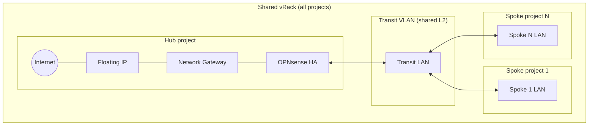
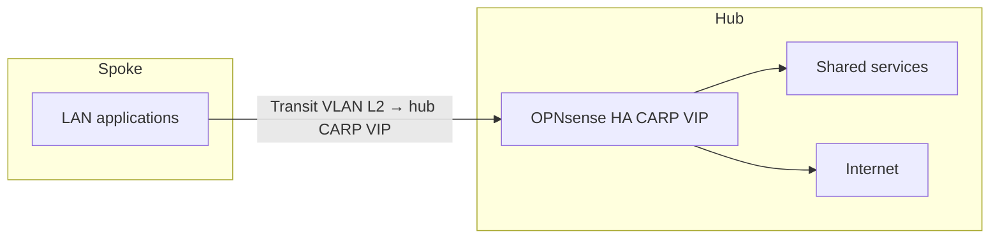

# Architecture — Mono-vRack + LAN transit

## Reference diagram

*(Source file: `docs/Schema one vRack LZ.png` at the repository root.)*

## Overview

In this architecture, **a single vRack** is shared across every bubble (hub + spokes). There is no IPsec tunnel between hub and spoke: connectivity relies on a shared **L2 transit VLAN** inside the vRack.

Main components:

- **A single vRack** shared by every Public Cloud project (hub + spokes).
- **OPNsense HA pair at the hub only** (`modules/firewall/opnsense-ha` module, role = `hub-simple`). Spokes have no firewall appliance of their own.
- **Transit VLAN**: each spoke has an L2 VLAN that connects it to the hub LAN; routing is handled by the hub OPNsense (CARP VIP).
- **Peering via REST API**: the spoke configures routing on the hub through the OPNsense API (`restapi` provider), without manual steps.

The modules:

- `modules/firewall/opnsense-ha` (role = `hub-simple`) — hub network, OPNsense HA pair, no IPsec configuration.
- `modules/network/spoke-one-vrack` — transit VLAN + spoke LAN (no firewall instances).

The deployments:

- `deployments/mono-vrack-lan-transit/landing-zone` — **Day‑1**: hub project, shared vRack, OPNsense HA pair.
- `deployments/mono-vrack-lan-transit/spoke-template` — **Day‑2**: new spoke, configures routing on the hub via API.

## Mermaid representation

## Logical diagram (application flow)

## Operator constraints

> These constraints are critical. Mistakes can lead to routing loss or network conflicts between spokes.

- **Unique VLANs**: every spoke must use a distinct VLAN ID for its transit network and its LANs. There is no automatic allocation mechanism — the operator must keep a registry.
- **Non-overlapping subnets**: every CIDR (transit + each spoke's LANs) must be disjoint. An overlap produces ambiguous routes on the hub OPNsense.
- **Hub deployed first**: the Day‑2 spoke calls the hub OPNsense API to configure routing; the hub must be operational before any spoke `apply`.
- **Hub routing capacity**: every inter-spoke and Internet-bound flow goes through the hub OPNsense pair — size the flavors accordingly.

## Cross references

- Cloud prerequisites: [OVH prerequisites](../../../docs/02-ovh-prerequisites.md).
- Deployment: [Day‑1](02-day1-landing-zone.md), [Day‑2](03-day2-spoke.md).
- Operations: [Lifecycle and operations](04-lifecycle-and-operations.md).
