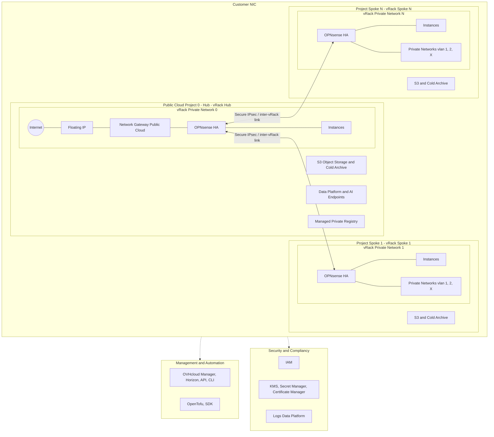
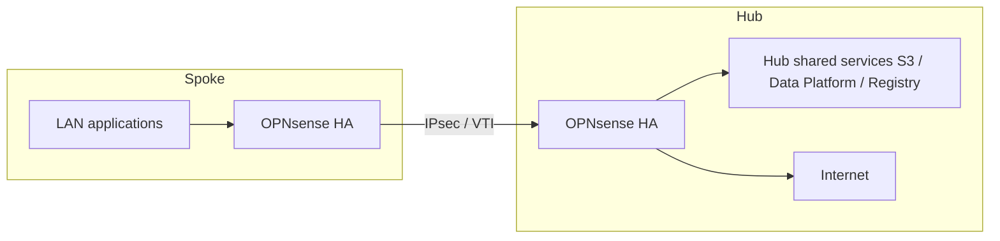

# Architecture

## Reference diagram

The official landing zone diagram (customer perimeter, hub, spokes, shared services and management / security foundation):

*(Source file: `docs/Schema Landing Zones.png` at the repository root.)*

## Overview

The platform relies on:

- **Separate OVHcloud Public Cloud projects** (hub "Project #0", then one project per spoke).
- **vRack**: private network per project; VLAN networks for WAN, LAN and firewall HA synchronisation.
- **OVH gateway** (`ovh_cloud_project_gateway`) for Internet access / WAN routing on the Public Cloud side.
- **OPNsense in active / passive cluster** (CARP, dedicated HASYNC interface) in every bubble.
- **IPsec (IKEv2)** between hub and spoke, with **VTI** and routes to reach the spoke LANs from the hub.

The main modules of the repository:

- `modules/firewall/opnsense-ha` (role = `hub-ipsec`) — network, hub OPNsense instances, floating IP, CARP WAN VIP.
- `modules/firewall/opnsense-ha` (role = `spoke-ipsec`) — same logic on the spoke side, tunnel to the hub.

The deployments:

- `deployments/multi-vrack-ipsec/landing-zone` — **Day‑1**: hub + QA spoke.
- `deployments/multi-vrack-ipsec/spoke-template` — **Day‑2**: new spoke + API peering on the hub.

## Mermaid representation (diagram approximation)

The PNG diagram remains the visual reference; the diagram below reproduces its structure (without pictograms or graphical detail).

## Logical diagram (application flow)

Typical traffic in a centralised model: workloads in the spoke LAN go to the hub (Internet egress or shared services at the hub).

## Points of attention

- **Uniqueness**: every spoke must have distinct **VLANs**, **CIDRs** and **`ipsec_reqid`** values to avoid collisions.
- **Single hub**: the spoke template assumes a hub is already deployed; the hub's OPNsense API credentials are generated at Day‑1 and reused for Day‑2 peering.
- **IPsec performance**: the crypto load depends on instance sizing (flavor) and OPNsense tuning — adjust based on your load tests.

## Cross references

- Cloud prerequisites: [OVH prerequisites](../../../docs/02-ovh-prerequisites.md).
- Deployment: [Day‑1](02-day1-landing-zone.md), [Day‑2](03-day2-spoke.md).
