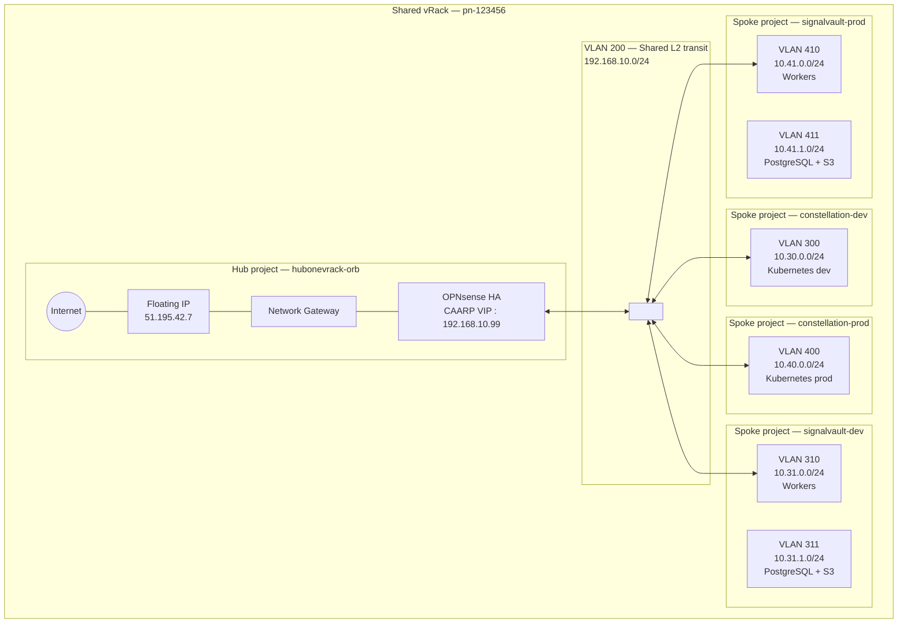
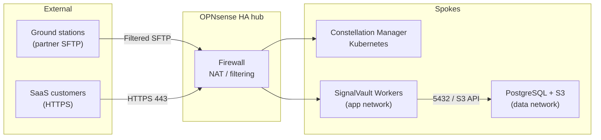

# 01 — Architecture

## Overview

OrbitalEdge deploys 4 spokes in a shared vRack, behind an OPNsense HA hub. Each application (Constellation Manager and SignalVault) has its own Public Cloud project for the development and production environments.

## VLAN registry

This registry is the source of truth for VLAN and CIDR allocation in the vRack. It must be updated before every new spoke.

| VLAN | Use | CIDR | Spoke | transit_router_ip |
|------|-----|------|-------|-------------------|
| 100 | Hub WAN | 10.1.0.0/24 | Hub (RESERVED) | — |
| 199 | Hub HASYNC | 10.0.254.0/30 | Hub (RESERVED) | — |
| 200 | Shared transit | 192.168.10.0/24 | All (SHARED) | — |
| 300 | Constellation Manager dev | 10.30.0.0/24 | constellation-dev | 192.168.10.10 |
| 310 | SignalVault dev — app | 10.31.0.0/24 | signalvault-dev | 192.168.10.11 |
| 311 | SignalVault dev — data | 10.31.1.0/24 | signalvault-dev | (same router) |
| 400 | Constellation Manager prod | 10.40.0.0/24 | constellation-prod | 192.168.10.20 |
| 410 | SignalVault prod — app | 10.41.0.0/24 | signalvault-prod | 192.168.10.21 |
| 411 | SignalVault prod — data | 10.41.1.0/24 | signalvault-prod | (same router) |

Hub DHCP pool on the transit (VLAN 200): `.100`–`.200`. All `transit_router_ip` values are outside that pool.

## Design rationale

### Why one spoke per environment (dev/prod separated)

An incident in dev (e.g. deployment of a corrupted image, uncontrolled load test) stays contained in the dev OVHcloud project. The prod projects have no direct connectivity with the dev projects — any inter-spoke traffic would go through the hub OPNsense, where a firewall rule explicitly forbids that communication.

### Why Constellation Manager on Managed Kubernetes

The workload has no local application state (state in an external database), auto-scales, and is operated by a team experienced with Kubernetes. OVHcloud Managed Kubernetes fits into a standard Public Cloud project: the Kubernetes nodes are instances in the spoke network, routed through the hub like any other VM.

### Why SignalVault on VMs + two separate networks

The `data` network (VLAN 311/411) isolates the managed PostgreSQL instances and S3 endpoints from the workers exposed to partners (`app` network, VLAN 310/410). If a worker is compromised through a partner SFTP connection, the attacker is in the `app` network and does not see the `data` network directly. The hub firewall controls traffic between the two.

> Note: OVHcloud managed PostgreSQL exposes a public endpoint (not directly inside the vRack). This endpoint is reached from the workers through the hub OPNsense, where a rule allows only port 5432 from the `app` CIDR to the PostgreSQL endpoint IP.

### Application flow (summary)

## Operator constraints for OrbitalEdge

- Never reuse a VLAN ID from the registry above.
- All CIDRs are disjoint — check before every new spoke.
- The hub must be operational before any spoke `tofu apply` (the OPNsense API must answer).
- The `b3-64` flavor is used for the hub given the cumulative traffic of the 4 production spokes.

---

← [00 — Context](00-context.md) | [02 — Governance →](02-governance.md)
