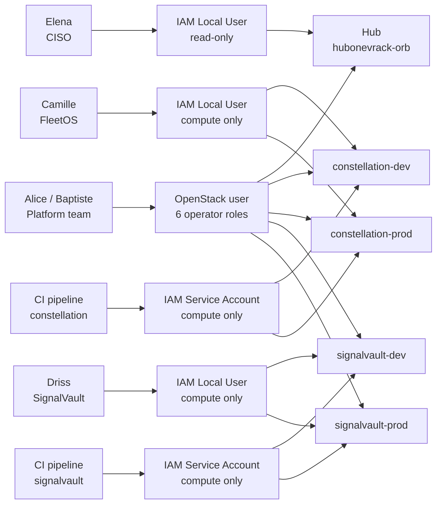

# 02 — Governance and identities

> **Manual prerequisite:** the IAM local users and service accounts described below are **not** created by Terraform. Create them in the OVHcloud Manager before running `tofu apply` on any spoke — see the [pre-flight checklist](../README.md#before-you-start-manual-prerequisites).

## Identity model

OrbitalEdge uses three distinct identity types, each tailored to a specific use.



```
┌─────────────────────────────────────────────────────────────────────┐
│                       OrbitalEdge identities                        │
├──────────────────────┬──────────────────────┬───────────────────────┤
│  Platform team       │  Developers          │  CI/CD pipelines      │
│  (Alice, Baptiste)   │  (Camille, Driss…)   │  (GitLab CI)          │
├──────────────────────┼──────────────────────┼───────────────────────┤
│ ovh_cloud_project_   │ OVHcloud IAM         │ OVHcloud IAM          │
│ user (OpenStack)     │ Local User           │ Service Account       │
│ 6 operator roles     │ + scoped IAM policy  │ + scoped IAM policy   │
├──────────────────────┼──────────────────────┼───────────────────────┤
│ Auth: Keystone       │ Auth: OVHcloud       │ Auth: OIDC →          │
│ username/password    │ Manager / OVH API    │ Keystone OpenStack    │
└──────────────────────┴──────────────────────┴───────────────────────┘
```

---

## Platform team — OpenStack service accounts

Alice and Baptiste use the `ovh_cloud_project_user` accounts created by Terraform (one per spoke) to deploy the IaC. These accounts hold 6 OpenStack roles:

| Role | Capability |
|------|------------|
| `compute_operator` | Instances, keypairs |
| `network_operator` | Networks, subnets, routers, floating IPs |
| `network_security_operator` | Neutron security groups |
| `image_operator` | VM images |
| `volume_operator` | Block storage volumes |
| `key-manager_operator` | Secrets and certificates |

**Why not the `administrator` role?** `administrator` grants access to managing the project's OpenStack users, quotas, billing and to deleting the project itself. Terraform needs none of those capabilities. If Alice's credentials leak, an attacker can create instances and change the network, but cannot delete the project or create new OpenStack users.

These accounts are managed in the `users.tf` of the landing-zone and of each spoke. They are not handed out to the application teams.

---

## Developers — individual IAM accounts

Camille (FleetOS) and Driss (SignalVault) each get an OVHcloud IAM Local User account — **create `camille.dubois` and `driss.el-fassi` manually in the OVHcloud Manager → *Identity and access → Local users* before the first `tofu apply`**. An IAM policy (created by Terraform) is then assigned to each one, scoped to their single Public Cloud project.

**Why IAM and not a shared OpenStack account?**

With a shared OpenStack `compute_user`, the whole FleetOS team uses the same credentials. If Camille leaves OrbitalEdge:
- Shared account → every credential must be rotated across the team, every dev environment updated, CI/CD included.
- IAM → only Camille's account is revoked in 30 seconds, with no impact on the rest of the team.

On top of that, IAM provides per-person audit trails in OVHcloud logs: we know who started which instance, and when.

**IAM policy for the FleetOS team (Terraform example):**

```hcl
# IAM policy for FleetOS developers — compute-only access on constellation-dev
resource "ovh_iam_policy" "fleeetos_dev_compute" {
  name        = "orbital-edge-fleeetos-dev-compute"
  description = "FleetOS developers — compute-only on constellation-dev"
  identities  = [
    "urn:v1:eu:identity:user:camille-nic123/camille.dubois",
    "urn:v1:eu:identity:user:camille-nic123/thomas.martin",
  ]
  resources = [
    ovh_cloud_project.constellation_dev.urn,
  ]
  allow = [
    "publicCloudProject:openstack:compute:*",
  ]
}
```

> The full list of available actions is discoverable through the OVHcloud API: `GET /iam/reference/action?resourceType=publicCloudProject`. OVHcloud's predefined permission groups (e.g. `publicCloudProject:openstack:compute`) bundle the common actions together.

**What the policy allows / forbids:**

| Action | Result |
|--------|--------|
| Start/stop an instance | ✅ Allowed |
| Create/delete an instance | ✅ Allowed |
| Manage its own keypairs | ✅ Allowed |
| Create a network / subnet | ❌ Forbidden (403) |
| Allocate a Floating IP | ❌ Forbidden (403) |
| Create a router | ❌ Forbidden (403) |
| Access the constellation-prod project | ❌ Out of policy scope |
| Access the signalvault-* projects | ❌ Out of policy scope |

FleetOS developers cannot create a network path that bypasses the hub OPNsense. They deploy workloads inside the network envelope configured by the platform team.

---

## CI/CD pipelines — IAM service accounts

Each GitLab CI pipeline gets its own OVHcloud IAM Service Account — **create `sa-ci-constellation` and `sa-ci-signalvault` manually in the OVHcloud Manager → *Identity and access → Service accounts* before the first `tofu apply`, and note the OAuth2 login (form `oauth2-EU.xxxx`) that appears next to each one**. A service account is a machine identity with a client_id + client_secret, authenticating to OpenStack via OIDC.

> **Service account URN format:** `urn:v1:eu:identity:credential:<nichandle>/oauth2-EU.<id>`. The OAuth2 login (e.g. `oauth2-EU.3ec9fdabdbe60ca3`) is visible in the OVHcloud Manager → Identity and access → Service accounts, or through `GET /me/api/oauth2/client`. This login (rather than the description `sa-ci-constellation`) is the one to use in the policy.

```hcl
# Service account for the constellation CI pipeline
# (created via the OVHcloud Manager or API — no dedicated Terraform resource yet)
# Reference: https://docs.ovhcloud.com/en/guides/account-and-service-management/account-information/iam-policies-api

resource "ovh_iam_policy" "ci_constellation" {
  name        = "orbital-edge-ci-constellation"
  description = "GitLab CI pipeline — constellation-dev automated deployments"
  identities  = [
    "urn:v1:eu:identity:credential:orbital-nic123/oauth2-EU.3ec9fdabdbe60ca3",
  ]
  resources = [
    ovh_cloud_project.constellation_dev.urn,
  ]
  allow = [
    "publicCloudProject:openstack:compute:*",
  ]
}
```

**Advantage over a shared OpenStack account:** if the GitLab CI runner is compromised or a secret rotation is needed, only this service account is affected. Camille's and the other developers' access stays untouched.

**OpenStack configuration in GitLab CI (environment variables):**

```yaml
# .gitlab-ci.yml — variables injected from GitLab CI secrets
deploy_constellation_dev:
  script:
    - kubectl apply -f manifests/
  variables:
    OS_AUTH_URL: "https://auth.cloud.ovh.net/v3"
    OS_AUTH_TYPE: "v3oidcclientcredentials"
    OS_IDENTITY_PROVIDER: "ovhcloud"
    OS_PROTOCOL: "openid"
    OS_CLIENT_ID: $SA_CI_CONSTELLATION_CLIENT_ID       # GitLab CI secret
    OS_CLIENT_SECRET: $SA_CI_CONSTELLATION_CLIENT_SECRET # GitLab CI secret
    OS_PROJECT_ID: "a1b2c3d4e5f6g7h8i9j0k1l2m3n4o5p6"  # constellation-dev project ID
```

---

## CISO — OPNsense audit access

Elena Varga has an OVHcloud IAM Local User account with a read-only policy on the hub project. She reaches the OPNsense WebGUI in read-only mode to audit the firewall rules and the logs.

The WebGUI URL is `https://51.195.42.7:8443`. A dedicated read-only OPNsense `audit` account was created by Alice during Day-1.

---

## SignalVault case: access to managed services

Driss reaches PostgreSQL and Object Storage through connection strings provisioned by the platform team into a secrets manager (internal HashiCorp Vault). He does not use his OVHcloud IAM account for these accesses — he uses application credentials (PostgreSQL connection string, S3 keys) exposed by the platform team as Terraform outputs and stored in Vault.

```
Platform team (Alice):
  tofu apply → creates the managed PostgreSQL instance
             → output: endpoint + user + password
             → stores it in Vault → secret/orbital-edge/signalvault-dev/db

Driss:
  vault read secret/orbital-edge/signalvault-dev/db → fetches the connection string
  → configures the application → no direct access to the OVHcloud API for the DB
```

---

## Access matrix (summary)

| Persona | Identity | Can deploy VMs | Can change the network | Can see every spoke |
|---|---|---|---|---|
| Alice / Baptiste | OpenStack user (6 roles) | ✅ | ✅ | ✅ (per project) |
| Camille (FleetOS) | IAM Local User | ✅ (constellation-* only) | ❌ | ❌ |
| Driss (SignalVault) | IAM Local User | ✅ (signalvault-* only) | ❌ | ❌ |
| CI pipeline | IAM Service Account | ✅ (targeted project only) | ❌ | ❌ |
| Elena (CISO) | IAM Local User read-only | ❌ | ❌ | hub read only |

---

## Secrets and sensitive variables management

The OrbitalEdge rule is the template's rule: **no secrets in files**.

| Variable | Where |
|----------|-------|
| CIDRs, VLAN, region, flavor | `terraform.tfvars` |
| Any secret (passwords, API keys, state passphrase) | `TF_VAR_*` injected from HashiCorp Vault |

See [05 — Security and secrets](../../../docs/05-security-and-secrets.md) for the full procedure.

---

← [01 — Architecture](01-architecture.md) | [03 — Day-1: Hub →](03-day1-hub.md)
