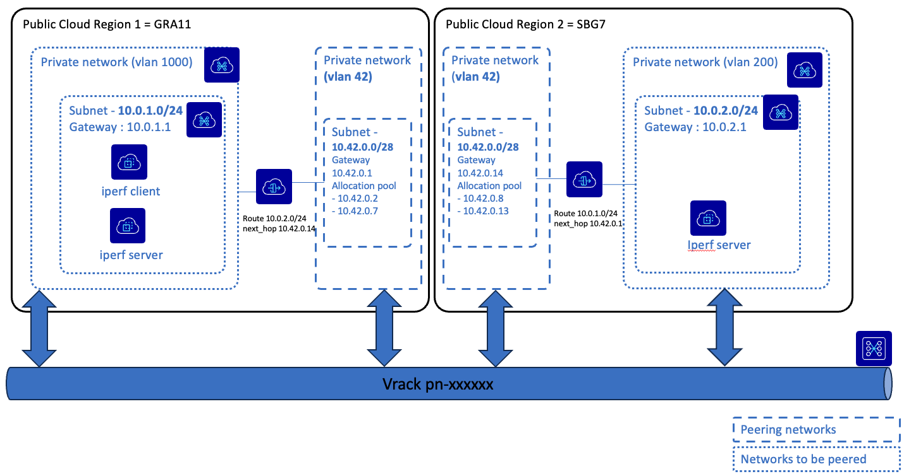
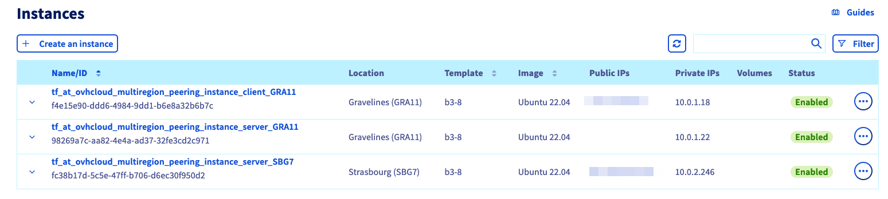
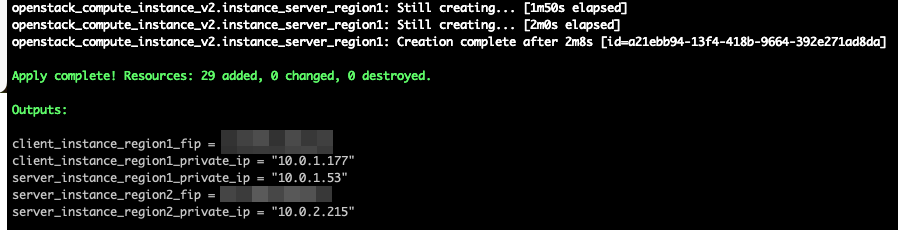

# How to Peer Two Subnets Across Different Public Cloud Regions Using Terraform/Opentofu

## Description

This examples deploys within one Public Cloud Project the following architecture : 





It will create in two different regions:
*  [2 private networks](https://www.ovhcloud.com/en-ie/public-cloud/private-network/) (as a reminder a private network is characterized by a VLAN id)
    * one that is local to the region. In this private network, we will spawn the instances, but it can receive any OVHcloud service. 
    * one that is used for peering. In order to peer the 2 regions, we will use the same VLAN id (`42`) in that example but this can be overridden through variable.
* 2 subnets: one in each private network.
* 1 router that will connect the "local" private network to the peering private network and will route traffic. The router is also used as a gateway to be able to create "Floating IP" which enables to connect to instances spawned in the private network.
* instances: in the first region we will spawn 2 instances with iperf (one as a client, the other as a server) and in the second region only one server instance


## Prerequisites

The prerequisites are the following:
* Terraform / Opentofu binary shall be installed on your machine. See [terraform doc](https://developer.hashicorp.com/terraform/install) or [opentofu one](https://opentofu.org/docs/intro/install/)
* an OVHcloud Public Cloud Project
* OVHcloud API key. See this [documentation](https://help.ovhcloud.com/csm/en-gb-api-getting-started-ovhcloud-api?id=kb_article_view&sysparm_article=KB0042784#advanced-usage-pair-ovhcloud-apis-with-an-application) to learn how to create one.


With those prerequisites, you should be able to set the following environment variables:
* `TF_VAR_ovh_public_cloud_project_id` with the id of your public cloud project: it can be found in OVHcloud control Panel on the top left of the screen, just below the name of your project.
* `OVH_ENDPOINT`
* `OVH_APPLICATION_KEY`
* `OVH_APPLICATION_SECRET`
* `OVH_CONSUMER_KEY`

## Variables 

The file [variables.tf](variables.tf) contains the variables that can be overriden through the [standard Terraform / Opentofu mechanism](https://developer.hashicorp.com/terraform/language/values/variables#assigning-values-to-root-module-variables)

Here is a sneak peak of the most important one :
* `region1` and `region2` shall contain regions that are activated in your public cloud project. It is composed of a trigram (e.g. `GRA`) and a number (e.g. `11`). The list of region are available on this [page](https://www.ovhcloud.com/en-ie/about-us/global-infrastructure/expansion-regions-az/)
* `instance_flavor` which is the type of flavor that we are going to create. Default is `b3-8`. Flavor list can be found on the [price page](https://www.ovhcloud.com/en-ie/public-cloud/prices/)
* `public_key_path` : the path to  your ssh public key. It is used to be able to connect to the instances.


## How to deploy

* Clone this repository
* `cd ` into this directory
* run `tofu init`
* run `tofu apply --auto-approve`

Once completed, you should see the three instances on OVHcloud control panel


## Outputs



The outputs are providing the necessary information to be able to connect to one instance (`client_instance_region1_fip`) and the private ip of the server in region1 (`server_instance_region1_private_ip`) and region2 (`server_instance_region2_private_ip`). This will be useful to test the performance. 


## Test the peering

* Connect to the client instance with its floating ip: `ssh ubuntu@<client_instance_region1_fip>`

You can try to ping the server in region2: `ping <server_instance_region2_private_ip>`

```bash
ubuntu@tf-at-ovhcloud-multiregion-peering-instance-client-gra11:~$ ping 10.0.2.246
PING 10.0.2.246 (10.0.2.246) 56(84) bytes of data.
64 bytes from 10.0.2.246: icmp_seq=1 ttl=62 time=11.8 ms
64 bytes from 10.0.2.246: icmp_seq=2 ttl=62 time=11.0 ms
64 bytes from 10.0.2.246: icmp_seq=3 ttl=62 time=10.7 ms
64 bytes from 10.0.2.246: icmp_seq=4 ttl=62 time=10.7 ms
```


Then test the TCP bandwidth with iperf
```bash 
ubuntu@tf-at-ovhcloud-multiregion-peering-instance-client-gra11:~$ iperf -c 10.0.2.215
------------------------------------------------------------
Client connecting to 10.0.2.215, TCP port 5001
TCP window size: 85.0 KByte (default)
------------------------------------------------------------
[  1] local 10.0.1.177 port 45962 connected with 10.0.2.215 port 5001
[ ID] Interval       Transfer     Bandwidth
[  1] 0.0000-10.0931 sec   350 MBytes   291 Mbits/sec
```

We observe that the bandwidth is the same as the one for the default flavor (`b2-7`)

## Looking into the code
Currently, the [ovh provider](https://registry.terraform.io/providers/ovh/ovh/latest/docs) does not cover all the features needed for the peering. Hence, we are using the [openstack provider](https://registry.terraform.io/providers/terraform-provider-openstack/openstack/latest).

The two specificities are the following:

    * To avoid the need to create an openstack user, in [provider.tf](./provider.tf), we use an [ovh_cloud_project_user](https://registry.terraform.io/providers/ovh/ovh/latest/docs/resources/cloud_project_user) resource that is then used to configure the openstack provider.
    * To define the routing, in [private_network_peering module](./modules/private_network_peering/), we use [openstack_networking_router_route_v2](https://registry.terraform.io/providers/terraform-provider-openstack/openstack/latest/docs/resources/networking_router_route_v2).

## Destroy the infrastructure

* run `tofu destroy --auto-approve`