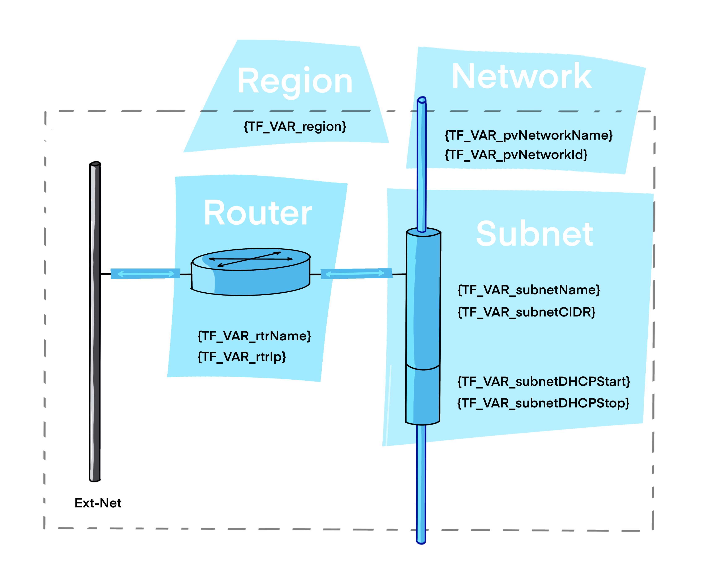

# Simple private network

This example builds a minimal private network infrastructure within OVHcloud Public Cloud.

The componants that will be created are : 

- A private network (built on [vRack](https://www.ovhcloud.com/en-gb/network/vrack)).

- A subnet, with a mix of DHCP and static range.

- A router that have the subnet gateway role.



## Pre-requisites

You need to follow steps from the [basics tutorial](../../basics/README.md) for having necessary tools and a fonctionnal `ovhrc` file.

## properties files

Edit the `properties` file to modify values according your needs:

```bash
# Region
export TF_VAR_region="${OS_REGION_NAME}"

# Network - Private Network
export TF_VAR_pvNetworkName="myPrivateNetwork"
export TF_VAR_pvNetworkId="30"

# Network - Subnet
export TF_VAR_subnetName="mySubnet"
export TF_VAR_subnetCIDR="192.168.2.0/24"
export TF_VAR_subnetDHCPStart="192.168.2.200"
export TF_VAR_subnetDHCPEnd="192.168.2.254"

# Network - Router
export TF_VAR_rtrName="myRouter"
export TF_VAR_rtrIp="192.168.2.1"
```

## createNetwork.sh

Create the network environment by executing the `createNetwork.sh` script.

```bash
./createNetwork.sh
```

<details><summary>See output</summary>

```bash
Initializing the backend...

Initializing provider plugins...
- Finding terraform-provider-openstack/openstack versions matching "~> 1.35.0"...
- Finding latest version of ovh/ovh...
- Installing terraform-provider-openstack/openstack v1.35.0...
- Installed terraform-provider-openstack/openstack v1.35.0 (self-signed, key ID 4F80527A391BEFD2)
- Installing ovh/ovh v0.22.0...
- Installed ovh/ovh v0.22.0 (signed by a HashiCorp partner, key ID F56D1A6CBDAAADA5)

Partner and community providers are signed by their developers.
If you'd like to know more about provider signing, you can read about it here:
https://www.terraform.io/docs/cli/plugins/signing.html

Terraform has created a lock file .terraform.lock.hcl to record the provider
selections it made above. Include this file in your version control repository
so that Terraform can guarantee to make the same selections by default when
you run "terraform init" in the future.

Terraform has been successfully initialized!

You may now begin working with Terraform. Try running "terraform plan" to see
any changes that are required for your infrastructure. All Terraform commands
should now work.

If you ever set or change modules or backend configuration for Terraform,
rerun this command to reinitialize your working directory. If you forget, other
commands will detect it and remind you to do so if necessary.
openstack_networking_network_v2.Ext-Net: Importing from ID "xxxxxxxx-ffdf-40f6-9722-xxxxxxxxxxxx"...
openstack_networking_network_v2.Ext-Net: Import prepared!
  Prepared openstack_networking_network_v2 for import
openstack_networking_network_v2.Ext-Net: Refreshing state... [id=xxxxxxxx-ffdf-40f6-9722-xxxxxxxxxxxx]

Import successful!

The resources that were imported are shown above. These resources are now in
your Terraform state and will henceforth be managed by Terraform.

openstack_networking_network_v2.Ext-Net: Refreshing state... [id=xxxxxxxx-ffdf-40f6-9722-xxxxxxxxxxxx]

Terraform used the selected providers to generate the following execution plan. Resource actions are indicated with the following symbols:
  + create

Terraform will perform the following actions:

  # openstack_networking_router_interface_v2.myRouterInterface will be created
  + resource "openstack_networking_router_interface_v2" "myRouterInterface" {
      + id        = (known after apply)
      + port_id   = (known after apply)
      + region    = (known after apply)
      + router_id = (known after apply)
      + subnet_id = (known after apply)
    }

  # openstack_networking_router_v2.myRouter will be created
  + resource "openstack_networking_router_v2" "myRouter" {
      + admin_state_up          = true
      + all_tags                = (known after apply)
      + availability_zone_hints = (known after apply)
      + distributed             = (known after apply)
      + enable_snat             = (known after apply)
      + external_gateway        = (known after apply)
      + external_network_id     = "xxxxxxxx-ffdf-40f6-9722-xxxxxxxxxxxx"
      + id                      = (known after apply)
      + name                    = "myRouter"
      + region                  = (known after apply)
      + tenant_id               = (known after apply)

      + external_fixed_ip {
          + ip_address = (known after apply)
          + subnet_id  = (known after apply)
        }
    }

  # openstack_networking_subnet_v2.mySubnet will be created
  + resource "openstack_networking_subnet_v2" "mySubnet" {
      + all_tags          = (known after apply)
      + cidr              = "192.168.2.0/24"
      + dns_nameservers   = [
          + "1.1.1.1",
          + "1.0.0.1",
        ]
      + enable_dhcp       = true
      + gateway_ip        = (known after apply)
      + id                = (known after apply)
      + ip_version        = 4
      + ipv6_address_mode = (known after apply)
      + ipv6_ra_mode      = (known after apply)
      + name              = "mySubnet"
      + network_id        = (known after apply)
      + no_gateway        = false
      + region            = "GRA9"
      + tenant_id         = (known after apply)

      + allocation_pool {
          + end   = "192.168.2.254"
          + start = "192.168.2.200"
        }

      + allocation_pools {
          + end   = (known after apply)
          + start = (known after apply)
        }
    }

  # ovh_cloud_project_network_private.myPrivateNetwork will be created
  + resource "ovh_cloud_project_network_private" "myPrivateNetwork" {
      + id                 = (known after apply)
      + name               = "myPrivateNetwork"
      + regions            = [
          + "GRA9",
        ]
      + regions_attributes = (known after apply)
      + regions_status     = (known after apply)
      + service_name       = "xxxxxxxxxxxx4017a6a6f6bxxxxxxxxx"
      + status             = (known after apply)
      + type               = (known after apply)
      + vlan_id            = 30
    }

Plan: 4 to add, 0 to change, 0 to destroy.

Changes to Outputs:
  + myPrivateNetworkID = (known after apply)
  + mySubnetID         = (known after apply)

──────────────────────────────────────────────────────────────────────────────────────────────────────────────────────────────────────────────────────────────────────────────────────────────────────────────────────────────────────────────────────────────────────────────────────────────────────

Note: You didn't use the -out option to save this plan, so Terraform can't guarantee to take exactly these actions if you run "terraform apply" now.
openstack_networking_network_v2.Ext-Net: Refreshing state... [id=xxxxxxxx-ffdf-40f6-9722-xxxxxxxxxxxx]

Terraform used the selected providers to generate the following execution plan. Resource actions are indicated with the following symbols:
  + create

Terraform will perform the following actions:

  # openstack_networking_router_interface_v2.myRouterInterface will be created
  + resource "openstack_networking_router_interface_v2" "myRouterInterface" {
      + id        = (known after apply)
      + port_id   = (known after apply)
      + region    = (known after apply)
      + router_id = (known after apply)
      + subnet_id = (known after apply)
    }

  # openstack_networking_router_v2.myRouter will be created
  + resource "openstack_networking_router_v2" "myRouter" {
      + admin_state_up          = true
      + all_tags                = (known after apply)
      + availability_zone_hints = (known after apply)
      + distributed             = (known after apply)
      + enable_snat             = (known after apply)
      + external_gateway        = (known after apply)
      + external_network_id     = "xxxxxxxx-ffdf-40f6-9722-xxxxxxxxxxxx"
      + id                      = (known after apply)
      + name                    = "myRouter"
      + region                  = (known after apply)
      + tenant_id               = (known after apply)

      + external_fixed_ip {
          + ip_address = (known after apply)
          + subnet_id  = (known after apply)
        }
    }

  # openstack_networking_subnet_v2.mySubnet will be created
  + resource "openstack_networking_subnet_v2" "mySubnet" {
      + all_tags          = (known after apply)
      + cidr              = "192.168.2.0/24"
      + dns_nameservers   = [
          + "1.1.1.1",
          + "1.0.0.1",
        ]
      + enable_dhcp       = true
      + gateway_ip        = (known after apply)
      + id                = (known after apply)
      + ip_version        = 4
      + ipv6_address_mode = (known after apply)
      + ipv6_ra_mode      = (known after apply)
      + name              = "mySubnet"
      + network_id        = (known after apply)
      + no_gateway        = false
      + region            = "GRA9"
      + tenant_id         = (known after apply)

      + allocation_pool {
          + end   = "192.168.2.254"
          + start = "192.168.2.200"
        }

      + allocation_pools {
          + end   = (known after apply)
          + start = (known after apply)
        }
    }

  # ovh_cloud_project_network_private.myPrivateNetwork will be created
  + resource "ovh_cloud_project_network_private" "myPrivateNetwork" {
      + id                 = (known after apply)
      + name               = "myPrivateNetwork"
      + regions            = [
          + "GRA9",
        ]
      + regions_attributes = (known after apply)
      + regions_status     = (known after apply)
      + service_name       = "xxxxxxxxxxxx4017a6a6f6bxxxxxxxxx"
      + status             = (known after apply)
      + type               = (known after apply)
      + vlan_id            = 30
    }

Plan: 4 to add, 0 to change, 0 to destroy.

Changes to Outputs:
  + myPrivateNetworkID = (known after apply)
  + mySubnetID         = (known after apply)
openstack_networking_router_v2.myRouter: Creating...
ovh_cloud_project_network_private.myPrivateNetwork: Creating...
openstack_networking_router_v2.myRouter: Still creating... [10s elapsed]
ovh_cloud_project_network_private.myPrivateNetwork: Still creating... [10s elapsed]
ovh_cloud_project_network_private.myPrivateNetwork: Creation complete after 16s [id=pn-xxxxxxxx_30]
openstack_networking_subnet_v2.mySubnet: Creating...
openstack_networking_router_v2.myRouter: Creation complete after 17s [id=xxxxxx-e0d3-4889-ae7e-xxxxxxxxxxxx]
openstack_networking_subnet_v2.mySubnet: Creation complete after 6s [id=xxxxxxxx-6a1d-4027-8ebe-xxxxxxxxxxxx]
openstack_networking_router_interface_v2.myRouterInterface: Creating...
openstack_networking_router_interface_v2.myRouterInterface: Still creating... [10s elapsed]
openstack_networking_router_interface_v2.myRouterInterface: Creation complete after 12s [id=xxxxxxxx-038e-4572-ad80-xxxxxxxxxxxx]

Apply complete! Resources: 4 added, 0 changed, 0 destroyed.

Outputs:

Ext-NetID = "xxxxxxxx-ffdf-40f6-9722-xxxxxxxxxxxx"
myPrivateNetworkID = "xxxxxxxx-cc06-49f7-8966-xxxxxxxxxxxx"
mySubnetID = "xxxxxxxx-6a1d-4027-8ebe-xxxxxxxxxxxx"
serviceName = "xxxxxxxxxxxx4017a6a6f6bxxxxxxxxx"
```

</details>

## importNetworks.sh

```bash
# oops!
rm -rf .terraform* terraform.tfstate*
```

You lost the Terraform plan? Import existing componants by executing the `importNetwork.sh` script:

```bash
./importNetwork.sh
```

<details><summary>See output</summary>

```bash
Initializing the backend...

Initializing provider plugins...
- Finding latest version of ovh/ovh...
- Finding terraform-provider-openstack/openstack versions matching "~> 1.35.0"...
- Installing ovh/ovh v0.22.0...
- Installed ovh/ovh v0.22.0 (signed by a HashiCorp partner, key ID F56D1A6CBDAAADA5)
- Installing terraform-provider-openstack/openstack v1.35.0...
- Installed terraform-provider-openstack/openstack v1.35.0 (self-signed, key ID 4F80527A391BEFD2)

Partner and community providers are signed by their developers.
If you'd like to know more about provider signing, you can read about it here:
https://www.terraform.io/docs/cli/plugins/signing.html

Terraform has created a lock file .terraform.lock.hcl to record the provider
selections it made above. Include this file in your version control repository
so that Terraform can guarantee to make the same selections by default when
you run "terraform init" in the future.

Terraform has been successfully initialized!

You may now begin working with Terraform. Try running "terraform plan" to see
any changes that are required for your infrastructure. All Terraform commands
should now work.

If you ever set or change modules or backend configuration for Terraform,
rerun this command to reinitialize your working directory. If you forget, other
commands will detect it and remind you to do so if necessary.
openstack_networking_router_v2.myRouter: Importing from ID "xxxxxx-e0d3-4889-ae7e-xxxxxxxxxxxx"...
openstack_networking_router_v2.myRouter: Import prepared!
  Prepared openstack_networking_router_v2 for import
openstack_networking_router_v2.myRouter: Refreshing state... [id=xxxxxx-e0d3-4889-ae7e-xxxxxxxxxxxx]

Import successful!

The resources that were imported are shown above. These resources are now in
your Terraform state and will henceforth be managed by Terraform.

openstack_networking_router_interface_v2.myRouterInterface: Importing from ID "xxxxxxxx-038e-4572-ad80-xxxxxxxxxxxx"...
openstack_networking_router_interface_v2.myRouterInterface: Import prepared!
  Prepared openstack_networking_router_interface_v2 for import
openstack_networking_router_interface_v2.myRouterInterface: Refreshing state... [id=xxxxxxxx-038e-4572-ad80-xxxxxxxxxxxx]

Import successful!

The resources that were imported are shown above. These resources are now in
your Terraform state and will henceforth be managed by Terraform.

openstack_networking_subnet_v2.mySubnet: Importing from ID "xxxxxxxx-6a1d-4027-8ebe-xxxxxxxxxxxx"...
openstack_networking_subnet_v2.mySubnet: Import prepared!
  Prepared openstack_networking_subnet_v2 for import
openstack_networking_subnet_v2.mySubnet: Refreshing state... [id=xxxxxxxx-6a1d-4027-8ebe-xxxxxxxxxxxx]

Import successful!

The resources that were imported are shown above. These resources are now in
your Terraform state and will henceforth be managed by Terraform.

ovh_cloud_project_network_private.myPrivateNetwork: Importing from ID "xxxxxxxxxxxx4017a6a6f6bxxxxxxxxx/pn-xxxxxxxx_30"...
ovh_cloud_project_network_private.myPrivateNetwork: Import prepared!
  Prepared ovh_cloud_project_network_private for import
ovh_cloud_project_network_private.myPrivateNetwork: Refreshing state... [id=pn-xxxxxxx_30]

Import successful!

The resources that were imported are shown above. These resources are now in
your Terraform state and will henceforth be managed by Terraform.

openstack_networking_network_v2.Ext-Net: Importing from ID "xxxxxxxx-ffdf-40f6-9722-xxxxxxxxxxxx"...
openstack_networking_network_v2.Ext-Net: Import prepared!
  Prepared openstack_networking_network_v2 for import
openstack_networking_network_v2.Ext-Net: Refreshing state... [id=xxxxxxxx-ffdf-40f6-9722-xxxxxxxxxxxx]

Import successful!

The resources that were imported are shown above. These resources are now in
your Terraform state and will henceforth be managed by Terraform.
```

</details>

## deleteNetwork.sh

Clean you environment by executing the `deleteNetwork.sh` script:

```bash
./deleteNetwork.sh
```

<details><summary>See output</summary>

```bash
Removed openstack_networking_network_v2.Ext-Net
Successfully removed 1 resource instance(s).
openstack_networking_router_v2.myRouter: Refreshing state... [id=xxxxxx-e0d3-4889-ae7e-xxxxxxxxxxxx]
ovh_cloud_project_network_private.myPrivateNetwork: Refreshing state... [id=pn-xxxxxxxx_30]
openstack_networking_subnet_v2.mySubnet: Refreshing state... [id=xxxxxxxx-6a1d-4027-8ebe-xxxxxxxxxxxx]
openstack_networking_router_interface_v2.myRouterInterface: Refreshing state... [id=xxxxxxxx-038e-4572-ad80-xxxxxxxxxxxx]

Terraform used the selected providers to generate the following execution plan. Resource actions are indicated with the following symbols:
  - destroy

Terraform will perform the following actions:

  # openstack_networking_router_interface_v2.myRouterInterface will be destroyed
  - resource "openstack_networking_router_interface_v2" "myRouterInterface" {
      - id        = "xxxxxxxx-038e-4572-ad80-xxxxxxxxxxxx" -> null
      - port_id   = "xxxxxxxx-038e-4572-ad80-xxxxxxxxxxxx" -> null
      - region    = "GRA9" -> null
      - router_id = "xxxxxx-e0d3-4889-ae7e-xxxxxxxxxxxx" -> null
      - subnet_id = "xxxxxxxx-6a1d-4027-8ebe-xxxxxxxxxxxx" -> null

      - timeouts {}
    }

  # openstack_networking_router_v2.myRouter will be destroyed
  - resource "openstack_networking_router_v2" "myRouter" {
      - admin_state_up          = true -> null
      - all_tags                = [] -> null
      - availability_zone_hints = [] -> null
      - distributed             = false -> null
      - enable_snat             = true -> null
      - external_gateway        = "xxxxxxxx-ffdf-40f6-9722-xxxxxxxxxxxx" -> null
      - external_network_id     = "xxxxxxxx-ffdf-40f6-9722-xxxxxxxxxxxx" -> null
      - id                      = "xxxxxx-e0d3-4889-ae7e-xxxxxxxxxxxx" -> null
      - name                    = "myRouter" -> null
      - region                  = "GRA9" -> null
      - tags                    = [] -> null
      - tenant_id               = "xxxxxxxxxxxx4017a6a6f6bxxxxxxxxx" -> null

      - external_fixed_ip {
          - ip_address = "51.210.147.144" -> null
          - subnet_id  = "xxxxxxxx-c441-4678-b395-xxxxxxxxxxxx" -> null
        }

      - timeouts {}
    }

  # openstack_networking_subnet_v2.mySubnet will be destroyed
  - resource "openstack_networking_subnet_v2" "mySubnet" {
      - all_tags        = [] -> null
      - cidr            = "192.168.2.0/24" -> null
      - dns_nameservers = [
          - "1.1.1.1",
          - "1.0.0.1",
        ] -> null
      - enable_dhcp     = true -> null
      - gateway_ip      = "192.168.2.1" -> null
      - id              = "xxxxxxxx-6a1d-4027-8ebe-xxxxxxxxxxxx" -> null
      - ip_version      = 4 -> null
      - name            = "mySubnet" -> null
      - network_id      = "xxxxxxxx-cc06-49f7-8966-xxxxxxxxxxxx" -> null
      - no_gateway      = false -> null
      - region          = "GRA9" -> null
      - tags            = [] -> null
      - tenant_id       = "xxxxxxxxxxxx4017a6a6f6bxxxxxxxxx" -> null

      - allocation_pool {
          - end   = "192.168.2.254" -> null
          - start = "192.168.2.200" -> null
        }

      - allocation_pools {
          - end   = "192.168.2.254" -> null
          - start = "192.168.2.200" -> null
        }

      - timeouts {}
    }

  # ovh_cloud_project_network_private.myPrivateNetwork will be destroyed
  - resource "ovh_cloud_project_network_private" "myPrivateNetwork" {
      - id                 = "pn-xxxxxxxx_30" -> null
      - name               = "myPrivateNetwork" -> null
      - regions            = [
          - "GRA9",
        ] -> null
      - regions_attributes = [
          - {
              - openstackid = "xxxxxxxx-cc06-49f7-8966-xxxxxxxxxxxx"
              - region      = "GRA9"
              - status      = "ACTIVE"
            },
        ] -> null
      - regions_status     = [
          - {
              - region = "GRA9"
              - status = "ACTIVE"
            },
        ] -> null
      - service_name       = "xxxxxxxxxxxx4017a6a6f6bxxxxxxxxx" -> null
      - status             = "ACTIVE" -> null
      - type               = "private" -> null
      - vlan_id            = 30 -> null
    }

Plan: 0 to add, 0 to change, 4 to destroy.

Changes to Outputs:
  - Ext-NetID          = "xxxxxxxx-ffdf-40f6-9722-xxxxxxxxxxxx" -> null
  - myPrivateNetworkID = "xxxxxxxx-cc06-49f7-8966-xxxxxxxxxxxx" -> null
  - mySubnetID         = "xxxxxxxx-6a1d-4027-8ebe-xxxxxxxxxxxx" -> null
  - serviceName        = "xxxxxxxxxxxx4017a6a6f6bxxxxxxxxx" -> null
openstack_networking_router_interface_v2.myRouterInterface: Destroying... [id=xxxxxxxx-038e-4572-ad80-xxxxxxxxxxxx]
openstack_networking_router_interface_v2.myRouterInterface: Still destroying... [id=xxxxxxxx-038e-4572-ad80-xxxxxxxxxxxx, 10s elapsed]
openstack_networking_router_interface_v2.myRouterInterface: Destruction complete after 15s
openstack_networking_router_v2.myRouter: Destroying... [id=xxxxxx-e0d3-4889-ae7e-xxxxxxxxxxxx]
openstack_networking_subnet_v2.mySubnet: Destroying... [id=xxxxxxxx-6a1d-4027-8ebe-xxxxxxxxxxxx]
openstack_networking_router_v2.myRouter: Destruction complete after 10s
openstack_networking_subnet_v2.mySubnet: Still destroying... [id=xxxxxxxx-6a1d-4027-8ebe-xxxxxxxxxxxx, 10s elapsed]
openstack_networking_subnet_v2.mySubnet: Destruction complete after 12s
ovh_cloud_project_network_private.myPrivateNetwork: Destroying... [id=pn-xxxxxxxx_30]
ovh_cloud_project_network_private.myPrivateNetwork: Still destroying... [id=pn-xxxxxxxx_30, 10s elapsed]
ovh_cloud_project_network_private.myPrivateNetwork: Destruction complete after 16s

Destroy complete! Resources: 4 destroyed.
```

</details>


