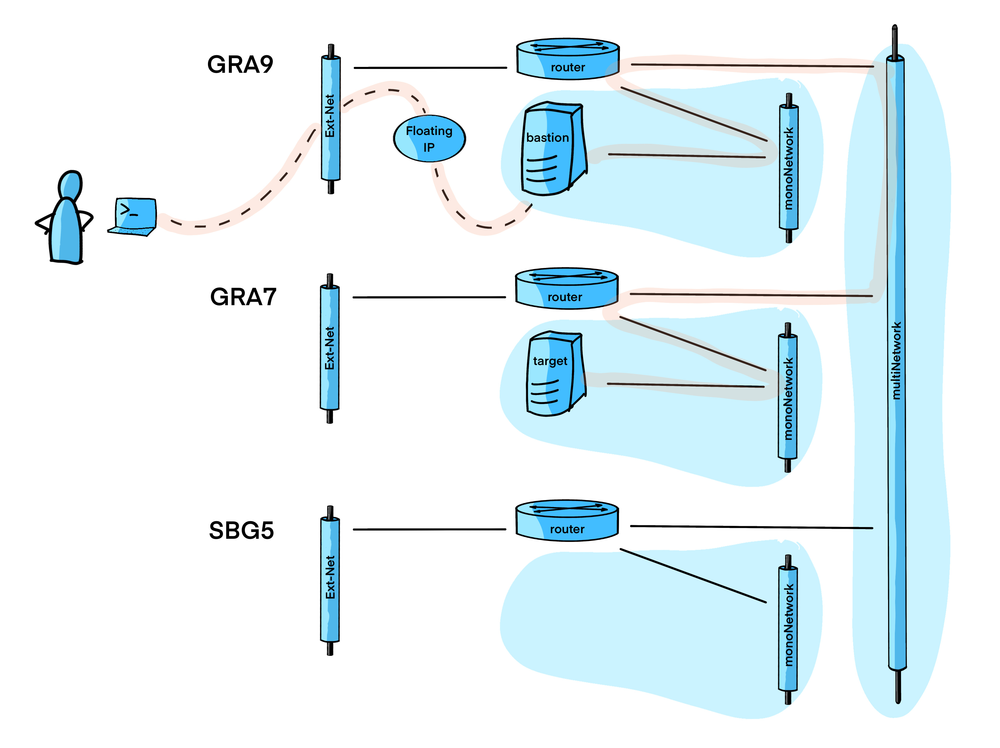

# Accessing an instance from a regional private network to another via vRack

This example builds 3 separated private routed networks on 3 regions. 

An additionnal network is build for communication between regions.

2 instances are build onto 2 distinct regions, the `bastion` one to access the private networks, and the `target` one that is simply builded to be accessed. 

The access to the `bastion` instance is permitted by `Floating IP` implementation.




## Pre-requisites

You need to follow steps from the [basics tutorial](../../basics/README.md) for having necessary tools and a fonctionnal `ovhrc` file.

## properties files

This is the parameters needed by the scripts:


Edit the `variables.auto.tfvars` file to modify values:

```terraform

```

## Create

Create the network environment with this commands:

```bash
source ovhrc
terraform init
terraform plan
terraform apply
```

<details><summary>See output</summary>

```bash

```

</details>

## Delete / Purge

Clean you environment with this commands:

```bash
source ovhrc
terraform destroy --auto-approve
```

<details><summary>See output</summary>

```bash

```

</details>


