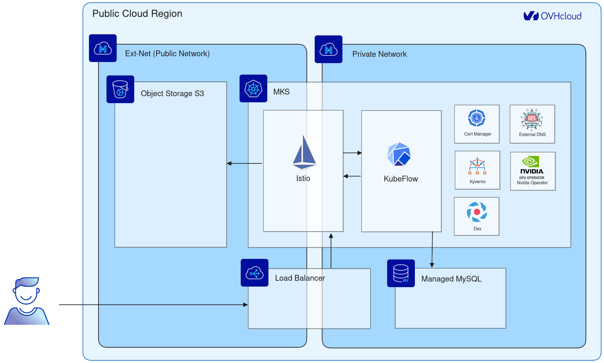

# Kubeflow on OVHcloud Public Cloud

The purpose of this tutorial is to deploy KubeFlow in an OVHcloud Managed Kubernetes cluster with all the essential tools.

This Terraform will create and configure:

* A private network
* A gateway
* A managed Kubernetes cluster
* A Public Cloud load balancer with a public IP
* A MySQL managed database
* An object storage bucket
* A Kubeflow deployment
* A Nvidia GPU Operator to install automatically Nvidia drivers on GPU nodes
* A Kyverno deployment to secure the workload created by the Kubeflow users
* A FQDN for Kubeflow
* Let's Encrypt TLS certificates for Kubeflow



**Requirements:**

You need the following:
* [Terraform](https://www.terraform.io/) installed
* An [OVHcloud Public Cloud project](https://www.ovhcloud.com/en/public-cloud/)
* An [OVHcloud vRack private network](https://www.ovhcloud.com/en/network/vrack/)
* An [OVHcloud domain name](https://www.ovhcloud.com/en/domains/)

As we are going to configure the infrastructure using a private network, your public cloud project needs to be in a vRack.

## Configure the deployment

### Configure the Terraform providers

Create an OVHcloud API token:

https://api.ovh.com/createToken?GET=/\*&POST=/\*&PUT=/\*&DELETE=/\*

Configure Terraform with this token:

```bash
vim ovhrc.sh
```

```bash
export OVH_ENDPOINT="ovh-eu"
export OVH_APPLICATION_KEY="<your_application_key>"
export OVH_APPLICATION_SECRET="<your_application_secret>"
export OVH_CONSUMER_KEY="<your_consumer_key>"
export OVH_CLOUD_PROJECT_SERVICE="<your_public_cloud_project_ID>"
```

You should create a second OVHcloud credential specific for the DNS configuration with limited permissions (better for security).

Create an API token with the following permissions:
https://www.ovh.com/auth/api/createToken

```
GET on /domain/zone
GET on /domain/zone/*/record
GET on /domain/zone/*/record/*
POST on /domain/zone/*/record
DELETE on /domain/zone/*/record/*
GET on /domain/zone/*/soa
POST on /domain/zone/*/refresh
```

```bash
vim ovhrc.sh
```

```bash
export TF_VAR_ovh_api_dns_application_key="<your_dns_application_key>"
export TF_VAR_ovh_api_dns_application_secret="<your_dns_application_secret>"
export TF_VAR_ovh_api_dns_consumer_key="<your_dns_consumer_key>"
```

Create a default Kubernetes configuration file if you don't already have one:

```bash
[ ! -f ~/.kube/config ] && { mkdir -p ~/.kube; touch ~/.kube/config; }
```

## Customize the deployment

Configure Terraform with your OVH domain name:

```bash
vim terraform.tfvars
```

```bash
ovh_dns_domain = "<your_ovh_domain_name>"
```

You can find the list of configuration variables in `variables.tf` and you can override the default values in `terraform.tfvars`.

## Deploy the stack

```bash
source ovhrc.sh
terraform init
terraform plan
terraform apply
```

## Access to the Kubeflow UI

Get the Kubeflow URL:

```bash
KUBEFLOW_URL=$(terraform output kubeflow_url)
echo $KUBEFLOW_URL
```

Get the username and password:

```bash
KUBEFLOW_USER=$(terraform output kubeflow_user)
KUBEFLOW_PASSWORD=$(terraform output kubeflow_password)
echo $KUBEFLOW_USER
echo $KUBEFLOW_PASSWORD
```

You can now access to the KubeFlow URL with the user and password.

You have to wait until the DNS propagation and then you should be able to reach the Kubeflow URL.

## Pipeline example

In the Kubeflow UI, in the menu on the left, click on `Experiments (KFP)` and create a new experiment.

Click on `Pipelines` and choose one of the existing pipeline (example: `[Tutorial] Data passing in python components`).
To launch the pipeline click on `Create Run` and choose in which experiment you would like to run the pipeline.

After a while the status of the run should turn green. You can see the logs of the run in your object storage.

## Troubleshoot

### Access the Kubernetes cluster

```bash
terraform output --raw ovh_kube_cluster_kubeconfig > ./kubeconfig
kubectl get nodes --kubeconfig ./kubeconfig
```