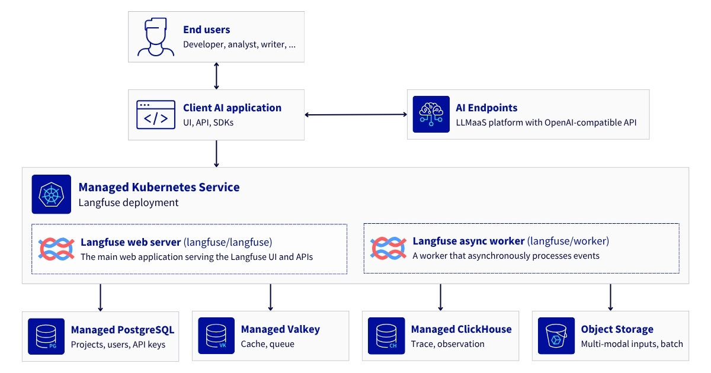

This project is linked to a reference architecture that illustrates the self-hosting of **Langfuse** on OVHcloud **Managed Kubernetes Service** (MKS) to capture every Large Language Model request as a trace (model, tokens, latency, cost, session, user). All of this is deployed within your own infrastructure, supported by OVHcloud’s managed Postgres, Valkey and ClickHouse services, as well as S3-compatible Object Storage for exports and multimedia files. 

## Prerequisites

Before you begin, ensure you have:
- An OVHcloud Public Cloud account
- An OpenStack user with the Administrator role
- An AI Endpoints API key
- A domain name you can point at a load balancer
- `kubectl` installed and `helm` installed (at least version 3.x)

## How to use the project

Follow the different steps of this [architecture guide](*publication in progress*) to maintain control over all data relating to requests, outputs and costs for LLMaaS-type platforms, whilst remaining within an infrastructure that you control.

