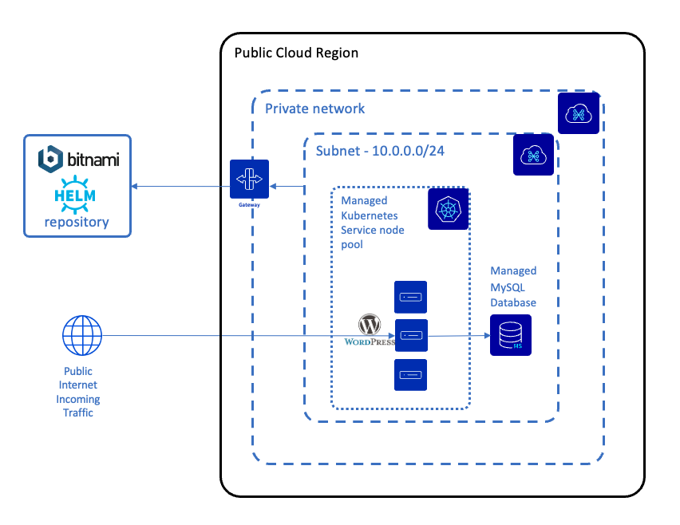

# Deploy a Wordpress website and MySQL DB with Terraform / OpenTofu

The purpose of this tutorial is to create a Mysql database and a Wordpress website and link them together in a Kubernetes cluster.



We will divide the project into two layers. The first layer is used to deploy the cluster and fetch the nodes. The second layer is used to deploy the services. Each layer is executed one by one.


## Requirements

You need the following:
* [Terraform](https://www.terraform.io/) or [OpenTofu](https://opentofu.org/) installed
* an [OVHcloud Public cloud project](https://www.ovhcloud.com/en/public-cloud/)
* OVHcloud API credentials
    * [EU](https://www.ovh.com/auth/?onsuccess=https%3A%2F%2Fwww.ovh.com%2Fauth%2FcreateToken%2F%3F)
    * [CA](https://ca.ovh.com/auth/?onsuccess=https%3A//ca.ovh.com%2Fauth%2FcreateToken%2F%3F)

## Set the environment variables

```bash
# OVHcloud provider needed keys
export OVH_ENDPOINT="ovh-eu"
export OVH_APPLICATION_KEY="xxx"
export OVH_APPLICATION_SECRET="xxx"
export OVH_CONSUMER_KEY="xxx"
export OVH_CLOUD_PROJECT_SERVICE="xxx"
```

### Layer 1 : Kubernetes

* Create a private network with a [gateway](https://www.ovhcloud.com/en-gb/public-cloud/gateway/)
* Deployment of a Managed Kubernetes cluster with its node pool deployed on the private network

### Layer 2 : MySQL & Wordpress

* Deployment of a managed MySQL DB with its OVHcloud user
* IP restriction on DBs
* Deployment of a Wordpress website with Helm using [bitnami package](https://github.com/bitnami/charts/tree/main/bitnami/wordpress/1)
* Interconnection of the DB and the website

### Configuration files

* provider.tf      : Contains the providers
* main.tf          : Contains the ressources and datasources 
* variables.tf     : Contains the variables we need to declare
* variables.tfvars : Contains the value of the variables
* output.tf        : Contains the output we want
* backend.tf       : Create the backend for the layering

### Variables

|Variable name        |Variable parameter   |Parameter description|
|---------------------|---------------------|---------------------|
|kubernetes|region|Region of the Kubernetes cluster|
|database|region|Region of the database|
|database|plan|Plan of the cluster|
|database|flavor|A valid OVHcloud public cloud database flavor name|
|database|version|The version of the engine in which the service should be deployed|

## Build and run

### Create the Terraform / OpenTofu variables file (configuration)

Two Terraform variables configuration files have been already created. Edit them to modify the needed information.

```bash
vi variables.tfvars
```
The following variable allows to deploy the Kubernetes cluster in GRA11 region:
```
kubernetes = {
    region = "GRA11"
}
database = {
    region       = "GRA"
    plan         = "essential"
    flavor       = "db1-7"
    version      = "8"
} 
```
Customize the values if needed.

### Validate the configuration 

```bash
tofu init
tofu plan -var-file=./variables.tfvars
```

### Create the complete architecture

```bash
tofu apply -var-file=./variables.tfvars -auto-approve
```

### Login into Wordpress 

Get the Load Balancer service IP
```bash
kubectl --kubeconfig=./kubeconfig.yml get svc
```

The Wordpress site is available at this IP. 

Wordpress' back-office is available under `/wp-admin/`. The default user is `user`, the generated password can be retrieved using :
```bash
kubectl --kubeconfig=./kubeconfig.yml get secret -n default wordpress -o jsonpath="{.data.wordpress-password}" | base64 -d |pbcopy
```

### Delete the DB and the Kubernetes cluster

```bash
tofu destroy -var-file=./variables.tfvars -auto-approve
```
