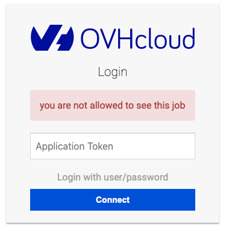

## Instructions to use the JupyterLab Notebook to create a model

Connect to your notebook and use the token authentification mode:

ℹ️ You can retrieve your Notebook URL with the following command: `ovhai notebook list --token $AI_TOKEN` or in the `attendee-conf.json` ℹ️

Open the notebook [rock-paper-scissors.ipynb](src/notebook/rock-paper-scissors.ipynb) and follow the instruction to fill the empty cells.  
ℹ️ You can access to the solution by opening the notebook [\[SOLUTION\]-rock-paper-scissors.ipynb](src/notebook/%5BSOLUTION%5D-rock-paper-scissors.ipynb)